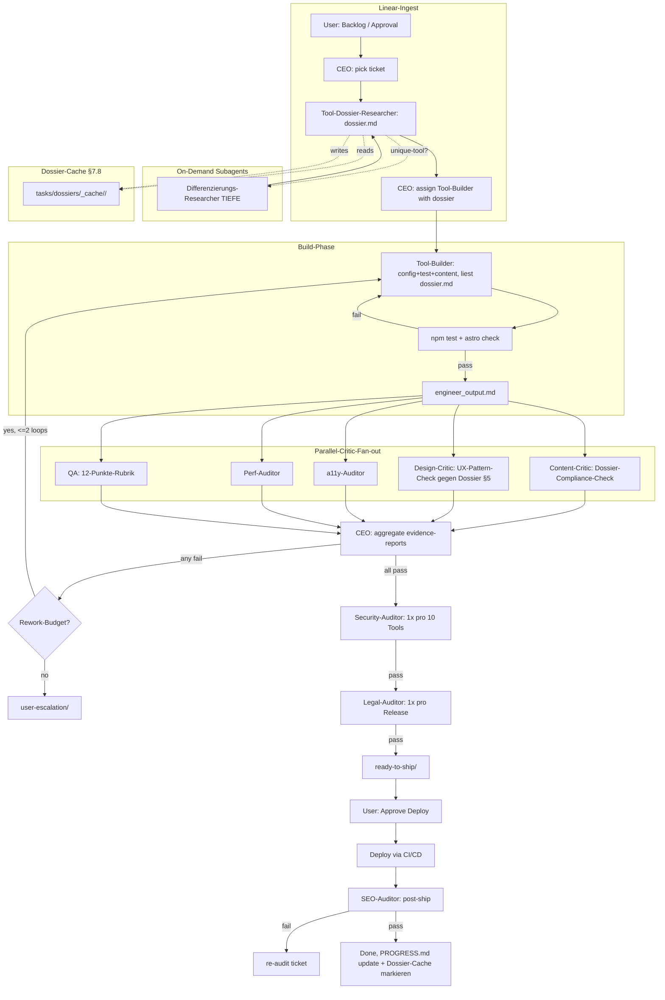

# Multi-Agent-Role-Matrix — Paperclip-Produktionslinie

> **Research-Report** — erstellt 2026-04-20 für Konverter-Webseite (Astro 5 SSG + Svelte 5 Runes + Tailwind).
> Tied to Paperclip `paperclipai@2026.416.0` (MIT). Kein Code, keine Installation — nur Recherche + Vorschlag.
> Scope: Rollen-Matrix + Workflow-Topologie + SOUL-Template-Sketches + Gap-Analyse vor `paperclipai init`.

---

## 1. Executive Summary

> **Revision v1.0 (2026-04-20):** Report-Erweiterung in Reaktion auf User-Kritik (5 Lücken / 3 Widersprüche / 4 Scope-Risiken / 2 Autonomie-Nachforderungen). Strukturelle Blindspots geschlossen: Critic-Eval (§2.8), Citation-Verify (§5.5), Observability + Kill-Switch (§7.11), DSGVO-Hygiene (§7.12), TTL-Tabelle (§7.13), Daten-Trigger-Scaling (§7.14), Autonomie-Gates neu (§7.15), Kostenlos-Constraint (§7.16). Neue Rolle: **Platform-Engineer**. Entfernt: **Visual-QA** (redundant mit Design-Critic + a11y-Auditor).

- **Rollen-Katalog: 13 aktive + 1 removed (v1.0).** +1 Platform-Engineer (Shared-Component-Regressions-Tests), −1 Visual-QA (redundant). 2 Phase-3-Spezialisten (Translator, i18n-Specialist) bleiben on-demand. Gesamt: 13 aktive Rollen + 2 Phase-3 = 15 Rollen-Katalog.
- **Start-Scope: 4 Rollen** (v1.0 revidiert): CEO + Tool-Dossier-Researcher + Tool-Builder + 1 Merged-Critic (Content + Design + QA). 9 weitere Rollen drafted aber inaktiv bis daten-getriggertes Scaling (§7.14) sie aktiviert. Begründung: „start with the simplest solution" — Anthropic-Prinzip wörtlich. Dossier-Researcher bleibt nicht verhandelbar (Produkt-Ziel „beste/gefragteste Tools"). §7.7 liefert Split-Trigger.
- **Topologie D (Hybrid, erweitert)**: Linear-Ingest → Pre-Build-Dossier → Builder → Parallel-Critics (Fan-out, im Start-Scope als Merged-Critic) → Evaluator-Optimizer-Loop → Linear Final-Gates. Dossier-Phase ist Pflicht-Gate vor Tool-Builder: ohne `dossier.md` kein Build-Ticket.
- **Heartbeat-Budget pro Ticket:** 5–7 HB im Start-Scope (4 bei Cache-Hit); voll-aktive Matrix 6–9 HB. Dossier-Researcher läuft parallel zu Brainstorming/CEO-Ticket-Prep, blockiert aber Builder-Start.
- **Autonomie-Modell: Auto-Resolve-Default + Daily-Digest** (§7.15). User-Eskalations-Trigger aus v0.9 werden zu Auto-Resolve-Aktionen: Rework>2 → Ship-as-is oder Park (Score-basiert); Rulebook-Drift → Auto-Snapshot; Dossier-Konflikt → Tie-Breaker-Reihenfolge. Einziger Live-Alarm-Kanal: **Emergency-Halt** bei Kosten-Überlauf / Security HIGH / Build-Fail-Rate > 50%. Alles andere landet in `inbox/daily-digest.md` (1× täglich).
- **Kostenlos-Constraint (hard-bound, §7.16):** WebFetch-first für alle URLs; Firecrawl max 3 Calls/Ticket (nur SPA/Bot-Block-Fälle); SerpAPI entfernt → AlsoAsked + Google-Suggest-Scrape (free). `tools/budget-guard.ts` blockt Paid-API-Calls bei Monats-Kontingent-Überschreitung. Keine paid API als Dependency.
- **Observability (§7.11):** `tasks/metrics.jsonl` speist `docs/paperclip/DASHBOARD.md` über CEO-Heartbeat-Tail-Step. Rubber-Stamping-Detection (Critic-PASS-Rate > 95% → Alarm), Queue-Tiefe, Rework-Raten, Heartbeat-Histogram, Citation-Verify-Fail-Rate. Kill-Switch via `.paperclip/EMERGENCY_HALT`-Flag-File mit Rollback-Procedure.
- **Critic-Eval-Datasets (§2.8):** `docs/paperclip/evals/<critic>/{pass,fail}-fixtures/` je 20 Fixtures mit expected.yaml. F1-Gate: darf nicht um > 0.05 fallen pro Prompt-Update. Proaktiv für die 3 Core-Critics vor `paperclipai init`; reaktiv für die anderen 4.
- **Citation-Verify-Pass (§5.5):** VOR Dossier-Gate-Pass. WebFetch-Re-Fetch + bigram-Jaccard ≥ 0.7 ODER Levenshtein ≤ 5%. Hard-Facts fail → Dossier-Rework; Paraphrasen → Warning. Edge-Cases (Paywall, Bot-Block, Reddit) explizit behandelt.
- **DSGVO-Hygiene (§7.12):** Pseudonymisierung aller Community-Zitate (`@user42` → `[reddit-user]`); `tasks/dossiers/`, `tasks/metrics.jsonl` in `.gitignore`; erasure_key pro Zitat. Legal-Auditor prüft Datenschutzerklärung gegen Research-Praxis.
- **Kategorie-spezifische TTLs (§7.13):** Physik-Konverter 365d (Länge/Gewicht/Temperatur), Format-Tools 180d (Image/Video/Document), zukünftige Krypto 30d. Override-Trigger bleiben (Analytics-Dip, Competitor-Launch, User-Feedback ≥3).
- **Kritischer Blocker vor `paperclipai init`:** 8 SOUL-Files (content-critic, design-critic, a11y-auditor, perf-auditor, security-auditor, legal-auditor, differenzierungs-researcher, tool-dossier-researcher) **plus 1 neu v1.0: platform-engineer** = **9 SOULs**. Zusätzlich: EVIDENCE_REPORT.md + DOSSIER_REPORT.md + 8 neue Ticket-Types + Eval-Bootstrap für 3 Core-Critics + `scripts/budget-guard.ts` + `scripts/metrics-digest.ts`. Siehe §6.1 für aktualisierte Tabelle.
- **Ein-Satz-Summary (v1.0):** Start mit 4-Rollen-Core inkl. Dossier-Pflicht; 9 weitere Rollen bleiben drafted aber inaktiv bis data-triggered Scaling sie aktiviert — Autonomie-Modell Auto-Resolve + Daily-Digest, Kostenlos-Policy hard-bound, Observability + Kill-Switch live, Critic-Eval verpflichtet.

---

## 2. Research-Findings

### 2.1 Anthropic Multi-Agent Design Patterns

Anthropic differenziert in „Building Effective Agents" (2024-12) zwischen **Workflows** (predefined code paths) und **Agents** (LLMs direct their own tools dynamically). Für unseren Content-Pipeline-Use-Case sind Workflows die richtige Wahl: predictability > autonomy bei 1000+ Tools mit ähnlicher Struktur.

**Fünf Workflow-Primitive** (verbatim-Begriffe):

1. **Prompt Chaining** — decompose task into fixed sequence; validate between steps. Use: Tool-Building (Config → Test → Content → Commit).
2. **Routing** — classifier dispatcht zu specialized handler. Use: Ticket-Type (`tool-build` vs `tool-audit` vs `tool-translate`) dispatcht an Tool-Builder vs Auditor vs Translator.
3. **Parallelization** — zwei Varianten:
   - **Sectioning** (independent subtasks, aggregated): parallel Critics auf Build-Output.
   - **Voting** (multiple attempts, consensus): 3× a11y-Audit bei kritischen Tools.
4. **Orchestrator-Workers** — central LLM dynamically decomposes + delegates + synthesizes. Use: CEO-Role im Paperclip-Sense.
5. **Evaluator-Optimizer** — one LLM generates, another evaluates with feedback, loop. Use: Tool-Builder ↔ QA mit max-2-Rework-Budget.

**Anthropic's eigenes Multi-Agent-Research-System** (Blog 2025-06): Orchestrator-Worker-Pattern + Artifact-Handoff (FileSystem statt Full-Context) + token-cost ~15× Single-Chat. Key-Takeaway: „**Start with the simplest solution, only add complexity when it demonstrably improves outcomes.**"

**Claude Code Subagents vs Agent Teams:**

| Dimension | Subagent | Agent Team |
|---|---|---|
| Kontext-Trennung | own, separate context | eigene, aber shared task list |
| Inter-Agent-Comm | nur via main agent | direkt via mailbox |
| Persistence | single session | persistent across sessions |
| Sweet-Spot | 1:1 delegation | 3–5 teammates |
| Tools | read/grep/write | + TaskCreate + TaskAssign + Mail |

Für unsere Produktionslinie = **Agent-Teams-Pattern** (persistence + mailbox + shared tasks), nicht Subagent-Burst. Paperclip implementiert genau das.

### 2.2 Paperclip-Ecosystem

**Core** (`paperclipai@2026.416.0`, MIT, by @vercel-labs-alumni):
- Pro Agent: 4 files — `AGENTS.md` (instructions), `SOUL.md` (persona), `TOOLS.md` (available tools), `HEARTBEAT.md` (tick-procedure).
- `$AGENT_HOME` = per-agent folder in `companies/<name>/<agent>/`.
- Plattform-agnostisch: Adapter für OpenClaw, Claude-Code, Codex, Cursor, Bash, HTTP-Endpoints.
- Memory-Pattern via `para-memory-files` skill (hierarchisch: global/company/agent-local).

**Bekannte Companies (paperclipai/paperclip repo):** 16 example-companies, darunter `default/` (7 agents: CEO, CTO, developer, QA, designer, pm, cs), `fullstack-forge/` (49 agents), `market-research/`, `research-agency/`.

**Plugins (npm query paperclip + github topic awesome-paperclip):**
- `hermes-paperclip-adapter` — HTTP-Endpoint-Adapter (web-hooks → agent-trigger).
- `@a5c-ai/babysitter-paperclip` — Stale-Lock-Recovery + Heartbeat-Overseer.
- `@paperclipai/create-paperclip-plugin` — Plugin-Scaffolder.
- Adapter-Pakete: `@paperclipai/openclaw-adapter`, `@paperclipai/codex-adapter`, etc.
- Skills-Integration: `paperclip`, `paperclip-create-agent`, `para-memory-files`, `company-creator`, `design-guide`.

**Heartbeat-Mechanik (verbatim aus default/ceo/HEARTBEAT.md):**
1. Identity (`cat SOUL.md AGENTS.md TOOLS.md`)
2. Local Planning (`para-memory-files`)
3. Approval Follow-Up (prev decisions)
4. Get Assignments (API)
5. Checkout and Work
6. Delegation
7. Fact Extraction
8. Exit

### 2.3 Production-Line-Rollen — welche Kritiker existieren + welche brauchen wir?

**Bereits drafted (in `docs/paperclip/souls/`):** ceo, tool-builder, qa, cto, visual-qa, translator, seo-audit — 7 SOULs.

**Literatur-Check (awesome-paperclip, claude-seo skill, claude-code community):**
- `claude-seo` skill liefert 19 sub-skills + 12 sub-agents für SEO-Pipeline (precedent für feingranulare Aufsplittung).
- Common-Pattern „Critic-Team": Content-Critic, Design-Critic, a11y-Critic, Perf-Critic, Security-Critic — Standard-Setup in Vercel-Labs-examples.
- Agentic-OWASP-Top-10 (2026-Edition) fordert explizit „supply-chain auditor" als separaten Agent.

**Gap-Analyse — Rollen, die für unser Tool-Pipeline-Risiko-Profil fehlen:**

| Rolle | Warum gebraucht | Alternative (nein) |
|---|---|---|
| **Content-Critic** | Frontmatter v2 hat 15 Felder + 6 Hard-Caps (§13.5) — QA-Rubrik deckt das NUR syntaktisch ab, nicht semantisch (em-Wahl, thin-content-Tone) | QA macht es = überlastet, Rubrik wird Copy-Paste statt Review |
| **Design-Critic** | Refined-Minimalism-Break-Detection (asymmetrie, gradients, rounded-full auf Buttons) braucht visuelle Augen | Visual-QA existiert ABER deckt nur Contrast/Focus-Ring, nicht Ästhetik-Cop |
| **a11y-Auditor** | axe-core + Playwright + Tab-Nav + Screen-Reader-Smoke-Tests = eigene Rolle | QA-Rubrik §10 macht nur axe-Smoke; tiefere a11y-Tests fehlen |
| **Performance-Auditor** | Core-Web-Vitals 2026 (INP ≤200ms, LCP ≤2.5s, CLS ≤0.1) + Lighthouse-CI-Budget-Check | Fehlt komplett |
| **Security-Auditor** | AdSense-CSP, XSS-via-Copy-Paste, CSRF-wenn-File-Tools, supply-chain-audit (npm-ls) | Fehlt komplett |
| **Legal/Compliance** | DSGVO-Text-Checks, AdSense-TOS-Compliance, Impressum/Datenschutz-Diff, Copyright-auf-Formel-Zitate | Fehlt komplett |
| **Differenzierungs-Researcher** | §2.4 in CLAUDE.md erzwingt 3-stufige Recherche pro Unique-Tool — als Subagent getriggert vom CEO | Aktuell ad-hoc vom User erledigt |
| **UX-Critic** (optional) | Flow-Tests: „Kann User ohne Scroll das Tool benutzen?" + Error-Edge-Case-Heuristik | Fehlt, aber low-priority |
| **i18n-Specialist** (Phase 3) | Phase-3-Trigger: 5 Sprachen live, hreflang-Graph-Audit, locale-Numerik-Policy-Enforcement | Translator drafted — aber übersetzt, nicht auditiert |

**Fazit:** 7 neue Rollen (Content-Critic, Design-Critic, a11y-Auditor, Perf-Auditor, Security-Auditor, Legal-Auditor, Differenzierungs-Researcher) + 1 optionale (UX-Critic) + 1 Phase-3 (i18n-Specialist). Addiert zu den 7 bestehenden SOULs = 14–15 Rollen-Katalog, aber **nur 10–11 aktiv pro Ticket**.

### 2.4 Workflow-Topologie — A/B/C/D?

**Kandidaten:**
- **A: Linear Pipeline** (Builder → QA → SEO → Ship) — einfach, aber seriell-lahm, Kritiker-Fan-out nicht möglich.
- **B: Parallel Fan-Out** (Builder → N Kritiker parallel → Aggregator → Ship) — schnell, aber kein Rework-Loop.
- **C: Evaluator-Optimizer-Loop** (Builder ↔ QA, max 2 Iterationen) — qualitätsgetrieben, aber nur 1:1, keine Multi-Critic.
- **D: Hybrid** — Linear-Ingest → Parallel-Critics-Fan-out → Evaluator-Optimizer-Loop bei Score <threshold → Linear-Final-Gates.

**Entscheidung: D.** Begründung:
1. Tool-Building = Prompt-Chain (Config→Test→Content), kein freies Exploring → Linear.
2. Kritiker sind orthogonal (Content-Critic liest kein Design-CSS, Design-Critic liest kein Frontmatter-Schema) → sie DÜRFEN parallel laufen ohne Race-Conditions.
3. Rework ist realistisch (Session-5 zeigte: 127/127 Tests + Rework für NBSP) → Loop mit Budget.
4. Legal + SEO-post-ship sind Sequential-Gates (Legal vor, SEO nach Deploy) → Linear-Tail.

### 2.5 SOUL-File-Templates — 3 Archetypen

Siehe Sektion 5 für verbatim Templates. Archetypen:

- **Builder-Archetyp** (tool-builder, translator) — Konstruktiv, testgetrieben, Commit-diszipliniert.
- **Critic-Archetyp** (content-critic, design-critic, a11y, perf, security, legal, seo-audit, visual-qa) — Evidenzbasiert, Pass/Fail-fokussiert, ein-Grund-ablehnen, Forbidden-Patterns-Liste.
- **Orchestrator-Archetyp** (ceo, cto) — Priorisierend, Budget-bewusst, Rulebook-Integrity-Hüter, User-Eskalations-Gate.

### 2.6 Gap-Analyse vor `paperclipai init`

**Bereits vorhanden** (`docs/paperclip/`):
- README.md (Prerequisites)
- BRAND_GUIDE.md v2 (12-Punkte-QA-Rubrik)
- TICKET_TEMPLATE.md (1-Tool-pro-Ticket)
- ONBOARDING.md (10-Step-Bootstrap)
- HEARTBEAT.md (30-min-default)
- SKILLS.md (installed skills)
- agents/ceo.md, agents/tool-builder.md, agents/qa.md — 3 Procedure-Files
- souls/{ceo, tool-builder, qa, cto, visual-qa, translator, seo-audit}.md — 7 Soul-Files

**Fehlt** (blocker vor init):
1. SOUL-Files für neue Rollen: `content-critic.md`, `design-critic.md`, `a11y-auditor.md`, `performance-auditor.md`, `security-auditor.md`, `legal-auditor.md`, `differenzierungs-researcher.md` — 7 Files.
2. AGENTS-Procedures für neue Rollen: `agents/content-critic.md`, `agents/design-critic.md`, `agents/a11y-auditor.md`, `agents/performance-auditor.md`, `agents/security-auditor.md`, `agents/legal-auditor.md`, `agents/differenzierungs-researcher.md` — 7 Files.
3. **Shared Evidence-Report-Standard** — `docs/paperclip/EVIDENCE_REPORT.md`: definiert, wie Kritiker ihre Fail/Pass-Befunde strukturieren (YAML-Frontmatter + Markdown-Body + Screenshots-Refs), damit CEO sie maschinell aggregieren kann.
4. **Neue Ticket-Types** im TICKET_TEMPLATE.md: `tool-audit-content`, `tool-audit-design`, `tool-audit-a11y`, `tool-audit-perf`, `tool-audit-security`, `tool-audit-legal`, `research-differentiation`. Aktuell nur `tool-build|tool-translate|tool-audit|bugfix` — zu grob.
5. **Parallel-Critic-Coordination-Protokoll** — HEARTBEAT.md §3 erweitern: wenn `tasks/awaiting-critics/<ticket-id>/` existiert, MUSS jeder Critic dort ein eigenes `<role>.md` ablegen; CEO aggregiert erst nach N-of-N (configurable: hard-gate 4 = Content/Design/a11y/Perf; soft-gate 2 = Security/Legal async).
6. **Rulebook-Integrity-Hook** — CEO-Heartbeat ruft `sha256 docs/paperclip/*.md > .paperclip/rulebook.sha.lock` vor jedem Cycle; drift → User-Eskalation.
7. **Budget-Tracker** — `tasks/budgets.yaml` listet pro Rolle max-Heartbeats + max-Reworks. Ohne das wird der Evaluator-Loop endlos.
8. **Companies-Ordner** — Paperclip erwartet `companies/konverter/{ceo,...}/` Struktur. Bisher liegt alles in `docs/paperclip/` — klar, aber `paperclipai init` wird neu scaffolden wollen. Symlink oder Move nötig.

### 2.7 Pro-Tool-Dossier-Research: Warum Standard- nicht Unique-only

**Anlass für die Erweiterung:** Im ersten Report (§2.3 + §2.4) war Pre-Build-Research NUR für Unique-Strategy-Tools vorgesehen — die 150 Launch-Unique-Tools bekamen via CLAUDE.md §6 eine dreistufige Recherche, die 150 Standard-Konverter rutschten ohne Pre-Build-Research direkt in die Build-Phase. User-Feedback 2026-04-20 hat das verworfen: **auch "Standard"-Konverter (Meter→Fuß, Celsius→Fahrenheit, kg→lb) müssen vor dem Build ein Dossier bekommen**, sonst wird unser Content und unsere UX austauschbar mit den 20 Top-Konkurrenten in jedem Slug.

**Begründung, warum §2.4-Differenzierungs-Recherche nicht reicht:**

1. **Scope-Lücke:** §2.4 fragt "was macht uns einzigartig?" — das ist Feature-Differenzierung. Aber Standard-Tools differenzieren sich zu 80 % über **UX-Details** (Copy-Button-Position, Error-Messages, Mobile-Keyboard-Type, Reverse-Toggle-Interaktion), **Content-Angle** (welches Framing, welche Beispiele), **Präzisions-Verhalten** (wie viele Dezimalstellen, historische Konstanten-Varianten) — nicht über Features.
2. **Aufwand-Miskalibrierung:** §2.4 ist 3-stufige Deep-Research mit Subagent-Delegation. Für Standard-Tools wäre das overkill. Standard-Tools brauchen ein **kompakteres, aber breit-strukturiertes** Dossier, das in 1–2 HB fertig ist, nicht eine §2.4-Deep-Research von 3–4 HB.
3. **Risiko ohne Dossier:** Wenn jeder Standard-Tool-Builder blind startet, baut er naive Best-Guess-UX, die 3 Monate nach Ship in Analytics-Daten als Friction-Punkt auftaucht. Pre-Build-Research spart Post-Ship-Redesign-Kosten um den Faktor 5–10 (Industrie-Benchmark aus Clearscope/MarketMuse).
4. **Differenzierungs-Chance bei Standard-Tools:** Gerade weil Konkurrenten bei Standard-Slugs müde sind (ads-überladen, 2010er-Copy, kein Mobile-Fokus), ist der Margin zum Mindest-UX-Benchmark groß — aber nur, wenn wir den Benchmark vor Build kennen.

**Präzedenz aus der Content-Production-Industrie:** Clearscope, MarketMuse, Surfer SEO, Ahrefs, Frase, ClearScope-Content-Briefs und Semrush-SEO-Content-Templates haben alle ein **Pre-Build-Brief-Pattern** etabliert, das jeden Artikel — nicht nur Flaggschiff-Pieces — mit einem strukturierten Dossier startet. Das Pattern wurde 2020–2025 breit validiert (Clearscope-Team-Workflows, MarketMuse-Content-Planning, Surfer-Real-Time-Content-Editor). Kernfelder sind immer dieselben:

| Brief-Tool | Pflichtfelder (Auszug) | Besonderheit |
|---|---|---|
| **MarketMuse** | Target-Keyword + Search-Volume + SERP-Intent + Keyword-Cluster + Topic-Model + Competitive-Analysis (Domain + Page-Count + Traffic-%) + Recommended-Questions + Custom-Style-Guide + Outline + Checklist | **Content-Score-Target** + Topic-Model (Breite vs Tiefe) |
| **Clearscope** | Primary-Keyword + Secondary-Keywords + Suggested-Terms (ranking-weighted) + Audience-Questions (PAA + snippets) + Competitor-Outlines (Top-30-H-Struktur) + Word-Count-Range + Readability + Internal/External-Links + Information-Gain-Field | **"Information Gain"** als Pflichtfeld — was uns wirklich neu macht |
| **Surfer SEO** | SERP-Analyzer + NLP-Terms + Content-Editor-Score + Internal-Link-Density + Competitor-Gap-Keywords | Real-Time-Scoring beim Schreiben, SERP-korreliert |
| **Ahrefs** | Working-Title + Goal + Audience + Sub-Topics + Unique-Angles + Practical-Details | **Intentional-Minimal** — Philosophy: brief = direction, nicht prescription |
| **Frase** | Research + Optimization + Brief + AI-Visibility-Score across 8 platforms | 6-Stage-Coverage: Research → Recovery |

**Take-aways für unseren Tool-Dossier-Standard:**

- MarketMuse + Clearscope sind die **reichhaltigsten Strukturen** → wir orientieren uns an Clearscope-Felder-Liste (17 Pflichtfelder) aber entfernen 4 (Brand-Voice, CTA, Revision-Plan, Customer-Journey-Stage), weil die bei einem Tool-Dossier nicht passen.
- **"Information Gain" von Clearscope** ist das Pflichtfeld, das unsere §2.4-Differenzierungs-Logik in einem einzelnen Feld kapselt — perfekt fürs Standard-Tool-Dossier.
- Ahrefs' Minimalismus ist Gegenpol: wenn wir zu viele Felder erzwingen, wird das Dossier Box-Ticking. Wir zielen auf **10 Pflicht-Sektionen** (User-Wunsch-Liste) + 4 optionale Felder für Unique-Tools.

**Präzedenz aus der Anthropic-Multi-Agent-Research-Literatur:** Anthropic's Multi-Agent-Research-System (Blog 2025-06) zeigt, dass ein Lead-Researcher (hier: unser CEO) parallel Subagenten spawnt, die **breadth-first** starten und dann progressively narrow werden. Schlüssel-Pattern:

- **Breadth-first Start:** "kurze, breite Queries" → Landschaft kartografieren. Das ist unsere Dossier-Sektionen 1–6 (Mechanik, Konkurrenz, Pain-Points, UX-Patterns, SEO, Content-Angle).
- **Depth-second Narrow:** basierend auf Erkenntnissen tiefer gehen. Das ist unsere Sektionen 7–10 (Edge-Cases, Validation, Differenzierungs-Hypothese, Re-Evaluation-Trigger).
- **Artifact-Handoff:** Subagent-Outputs bypassen den Coordinator → werden als Dateien abgelegt. Das mappt 1:1 auf `tasks/dossiers/<ticket-id>/dossier.md` als persistenter Artifact, den Tool-Builder + Content-Critic + Design-Critic lesen, ohne dass Dossier-Researcher-Context weitergereicht wird.
- **Scaling-Effort-Rules:** simple Facts = 1 Agent, Comparisons = 2–4 Subagenten. Für uns: Standard-Tool-Dossier = 1 Researcher-Session (1–2 HB); Unique-Tool-Dossier = Diff-Researcher läuft zusätzlich parallel (Subagent).
- **Parallel-Tool-Calling:** "cuts research time up to 90 %" für komplexe Queries. Dossier-Researcher ruft Firecrawl + SerpAPI + WebSearch parallel in einem Heartbeat-Slot.

**Entscheidung:** Tool-Dossier-Researcher wird als **neue, separate Rolle 12** eingeführt — NICHT gemerged mit Rolle 11 (Differenzierungs-Researcher). Begründung:

- **Unterschiedliche Trigger-Bedingungen:** Rolle 12 triggert auf JEDES Tool-Ticket (Pflicht-Gate). Rolle 11 triggert nur auf Unique-Strategy-Tools (Subagent-on-demand).
- **Unterschiedliche Tiefe:** Rolle 12 ist breit + strukturiert (10 Pflicht-Sektionen, 1–2 HB). Rolle 11 ist tief + explorativ (3-stufige Deep-Research, 3–4 HB, mit User-Wish-Quote-Mining in Communities).
- **Unterschiedliche Outputs:** Rolle 12 → `dossier.md` (feste Schablone). Rolle 11 → `§2.4-differenzierungs-block.md` (freiformige Hypothesen).
- **Komplementär, nicht redundant:** Bei Unique-Tools laufen BEIDE — Rolle 12 liefert die Standard-Struktur, Rolle 11 ergänzt die tiefere Differenzierungs-Ebene. Beide schreiben in `tasks/dossiers/<ticket-id>/` aber in getrennte Files: `dossier.md` vs `differentiation-deep-research.md`. Der Tool-Builder liest primär `dossier.md`, die Differenzierungs-Hypothese in §9 des Dossiers referenziert die tiefere Analyse.
- **Merge wäre künstlich:** ein gemergeder "Mega-Researcher" würde bei Standard-Tools 80 % der Arbeit unnötig machen (jede Celsius→Fahrenheit-Konversion bekommt eine Trends-2026-Analyse?) oder bei Unique-Tools die Pflicht-Struktur verwässern.

### 2.8 Evaluation der Kritiker (Critic-Eval-Datasets)

**Anlass (User-Kritik v1.0):** v0.9 postuliert Content-Critic, Design-Critic, a11y-Auditor als Qualitäts-Garanten, testet sie aber selbst nicht. Ein Critic, der stumpfsinnig `PASS` schreibt, ist toxischer als gar kein Critic — er erzeugt False-Confidence. „Quis custodiet ipsos custodes" ist keine rhetorische Frage, sondern ein Build-Schritt.

**Mechanik — Critic-Eval-Dataset pro Critic:**

Ordner-Struktur:

```
docs/paperclip/evals/
├── content-critic/
│   ├── pass-fixtures/     # 20 Files, die PASSen müssen (kein §13.5-Verstoß)
│   ├── fail-fixtures/     # 20 Files mit markierten Verstößen + expected-fail-code
│   └── expected.yaml      # fixture-id → expected PASS|FAIL|partial + rule-codes
├── design-critic/
│   ├── pass-fixtures/     # 20 Svelte-Komponenten, Token-clean
│   ├── fail-fixtures/     # 20 Svelte-Komponenten mit hex/px/rounded-full/etc.
│   └── expected.yaml
├── a11y-auditor/
│   ├── pass-fixtures/     # 20 HTML-Snippets, axe-clean
│   ├── fail-fixtures/     # 20 HTML-Snippets mit labeled violations
│   └── expected.yaml
├── perf-auditor/
│   ├── pass-fixtures/     # 20 Build-Outputs, Budget grün
│   ├── fail-fixtures/     # 20 mit inflated JS / broken CWV
│   └── expected.yaml
├── security-auditor/
│   ├── pass-fixtures/
│   ├── fail-fixtures/
│   └── expected.yaml
├── legal-auditor/
│   ├── pass-fixtures/
│   ├── fail-fixtures/
│   └── expected.yaml
└── dossier-researcher/
    ├── pass-fixtures/     # 10 valide Dossiers
    ├── fail-fixtures/     # 10 mit Halluzinations-/Leerstand-/Staleness-Fehlern
    └── expected.yaml
```

Jedes Fixture-File enthält Frontmatter mit `expected_result: PASS|FAIL|partial`, `expected_codes: [§13.5-R4, §13.5-R2]` (bei FAIL), `notes: <why>`. Das Format spiegelt `EVIDENCE_REPORT.md` — Critic-Output wird direkt gegen expected.yaml diffbar.

**Regressions-Protokoll (bei jedem Critic-Prompt-Update):**

1. Critic-Version N läuft gegen komplettes Fixture-Set (pass + fail).
2. Scoring: Precision, Recall, F1 pro Rule-Code; aggregiert ein F1-Score pro Critic.
3. Vergleich zu Vorversion N-1 (letzter Run liegt in `evals/<critic>/history/<semver>.results.yaml`).
4. Auto-Gate: F1 darf nicht um > 0.05 fallen ggü. N-1. Fall → Critic-Rollback oder Prompt-Bugfix.
5. **Rubber-Stamping-Detection:** wenn `PASS-Rate auf fail-fixtures > 10%` = Critic ist zu nachgiebig → Alarm. Wenn `FAIL-Rate auf pass-fixtures > 10%` = zu streng → Alarm.
6. Fail-Diff-Bericht landet in `evals/<critic>/history/<timestamp>.diff.md` — welche Fixtures haben gedreht, warum.

**Refresh-Cadence:**

| Trigger | Action |
|---|---|
| Critic-SOUL- oder AGENTS-Prompt-Update | Full Eval-Run vor Commit, Score ins Commit-Trailer |
| Neue Forbidden-Pattern in BRAND_GUIDE §4 | +2 fail-fixtures, +1 pass-fixture; Re-Eval |
| False-Positive/Negative in Prod entdeckt | Fixture hinzufügen, Re-Eval |
| Monatlicher Routine-Check | Full Run, F1-Trend in `DASHBOARD.md` (§7.11) |

**Tooling-Empfehlung (Tradeoff-Notiz):**

| Option | Pro | Contra | Verdict |
|---|---|---|---|
| **Vitest + golden-file-Pattern** | Schon im Stack (npm-dep vorhanden), JS-native, lokal | Für LLM-Eval unelegant (kein Prompt-Diff-UI) | Fit für Code-nahe Critics (Design-Critic, Security-Auditor) |
| **promptfoo** | LLM-Eval-native, YAML-konfig, Multi-Provider | Neue dev-dep, kostenfrei aber Anthropic-Key-Nutzung | Fit für Prompt-heavy Critics (Content-Critic, Dossier-Researcher) |
| **lm-eval-harness (EleutherAI)** | Standard in Research | Python-Stack, Overkill für 20-Fixture-Sets | Nein — zu schwer für unseren Scope |
| **deepeval** | Python, G-Eval + Hallucination-Metric | Python-Stack-Bruch | Nein, außer wir bauen Python-Sidecar |

**Entscheidung:** **promptfoo** für prompt-zentrische Critics (5 Stück) + **Vitest golden-files** für Code-Critics (2 Stück). Beide laufen in einem `npm run eval:critics`-Target, Output als JSON → gemergt ins DASHBOARD.

**Tradeoff akzeptiert:** +1 dev-dep (promptfoo). Alternative wäre home-grown Vitest-Diff-Runner — spart Dep, aber 2 Tage Bau und wir erfinden ein bestehendes Tool nach. YAGNI sagt: Tool nehmen.

**Fixture-Sourcing (wo kommen die 20×2 pro Critic her?):**

1. Bestehende Tool-Content-Files (aktuell 8 DE-Tools) als pass-fixtures.
2. Vergangene Rework-Iterationen aus Session 5–7 (NBSP-Fehler, hex-Leak) als fail-fixtures — Git-History hat Rohmaterial.
3. Manuell konstruierte Edge-Cases (explizit verbotene Patterns aus BRAND_GUIDE §4).
4. Ziel: 40-Fixture-Set pro Critic ist Bootstrap, wächst bei jedem False-Positive/Negative in Prod organisch.

**Kalt-Start-Tradeoff:** Eval-Bootstrap kostet ~1 Arbeitstag pro Critic × 7 Critics = ~7 Tage. Alternativ: starten ohne Eval und baue es, wenn erster Regressions-Vorfall eintritt (reaktiv). Empfehlung: **proaktiv für die 3 Core-Critics (Content, Design, a11y) vor `paperclipai init`; reaktiv für die anderen 4.**

---

## 3. Rollen-Matrix

| # | Rolle | Kernfrage | Input | Output | Pass/Fail-Kriterium | Tools | Trigger |
|---|---|---|---|---|---|---|---|
| 1 | **CEO / Orchestrator** | Welches Ticket als nächstes? Ist User-Approval-Gate erreicht? | Backlog, Ticket-Status, engineer_output.md, qa_results.md, evidence-reports | current_task.md, ready-to-ship/, user-escalation/ | Ticket existiert, Rulebook-Hash stimmt, Dependencies resolved | Read, Write, Grep, Bash (sha256sum, git log), TaskCreate | Heartbeat (every 30 min) |
| 2 | **Tool-Builder** | Baut {Config + Test + Content} für genau 1 Tool, Sprache | current_task.md (Ticket-YAML) | 3 Files + engineer_output.md | `npm test` exit 0, `astro check` 0/0/0, wc ≥300 Wörter, Commit-Trailer | Read, Write, Edit, Bash (npm test, git), Grep | CEO-Assignment |
| 3 | **QA / Test-Runner** | 12-Punkte-Rubrik pass/fail pro Build | engineer_output.md + changed files | qa_results.md | 12/12 pass; jede Fail-Kategorie = Re-Work-Ticket | Bash (npm, grep), Read, Playwright-MCP | Nach engineer_output.md |
| 4 | **Content-Critic** | §13.5 Forbidden-Patterns + Frontmatter-Semantik? | content/{slug}/{lang}.md | evidence-report (content-critic.md) | 0 verbotene em-Wraps, ≥300 Wörter Substanz, Tone nicht Marketing-Sprech, FAQ-Antworten fachlich korrekt | Read, Grep, WebSearch (Fakten-Check), Skill(`paperclip.design-guide`) | Parallel to QA |
| 5 | **Design-Critic** | Refined-Minimalism-Break? Token-Drift? | Components/*.svelte + screenshots | evidence-report (design-critic.md) | Keine hex/px, keine asymmetry, Graphit+Orange only, AAA ≥7:1 auf allen Text+BG-Paaren, Primary-Button graphit | Grep (hex-regex, arbitrary-px-regex), Read, Playwright-Screenshot, Skill(`minimalist-ui`, `frontend-design`) | Parallel to QA |
| 6 | **a11y-Auditor** | WCAG AAA + Tab-Nav + Screen-Reader-Smoke? | Built page URL | evidence-report (a11y-auditor.md) | axe-core 0 fails, Tab-Order logisch, focus-ring sichtbar, alt-texts present, form-labels associated | Playwright (axe-core Integration), Bash (lighthouse a11y) | Parallel to QA |
| 7 | **Performance-Auditor** | Core-Web-Vitals 2026 im Budget? Bundle-Size? | Built page URL, dist/ | evidence-report (perf-auditor.md) | INP ≤200ms, LCP ≤2.5s, CLS ≤0.1, JS-Bundle ≤50KB per tool-page, Lighthouse-Perf ≥90 | Lighthouse-CI, Bash (npm run build, du), Playwright | Parallel to QA |
| 8 | **Security-Auditor** | CSP, XSS-Surface, supply-chain? | dist/, package-lock.json, Component-Source | evidence-report (security-auditor.md) | CSP-Header gesetzt; keine inline-eval; `npm audit` nur low; keine neuen prod-deps ohne User-Approval | Bash (npm audit, grep), Read | Pre-Ship (1× pro 10 Tools) |
| 9 | **Legal/Compliance-Auditor** | DSGVO-Text aktuell? AdSense-TOS ok? Impressum vollständig? | Content-Files + static-pages/{impressum,datenschutz}.md | evidence-report (legal-auditor.md) | Impressum: Name/Anschrift/Kontakt/USt-ID; Datenschutz aktuell (letzte Revision ≤90 Tage); AdSense-Disclaimer wenn Ads aktiv | Read, WebSearch (BGH-Rulings, DSGVO-News) | Pre-Ship (1× pro Release) |
| 10 | **SEO-Auditor** (post-ship) | Schema-Markup valid? Sitemap-Diff? Canonicals? | live URL post-deploy | seo-audit-report.md | JSON-LD (WebApp+FAQPage+Breadcrumb) valid laut schema.org validator, sitemap.xml enthält new slug, canonical correct, hreflang complete | WebFetch (schema validator), Bash (curl) | Post-Ship |
| 11 | **Differenzierungs-Researcher** | Competitor-Matrix + User-Wishes + Trends für Unique-Tools (TIEFE) | Tool-Name, Kategorie | §2.4-Sektion für Spec + `differentiation-deep-research.md` | 5–7 Konkurrenten mit USP; 3 wörtl. User-Pain-Zitate; 2026-Trend-Liste | WebFetch, WebSearch, Firecrawl (Reddit/HN/ProductHunt), optional SerpAPI | Nur bei Unique-Strategy-Tools, Subagent vom CEO, läuft PARALLEL zu Rolle 12 |
| 12 | **Tool-Dossier-Researcher** (NEU) | Pre-Build-Dossier für JEDES Tool (BREITE) — Mechanik + Konkurrenz + UX-Patterns + SEO-Landschaft + Edge-Cases | Ticket-ID, Tool-Name, Kategorie, Zielsprache | `dossier.md` (10 Pflicht-Sektionen, §5.4-Schablone) | 10/10 Sektionen ausgefüllt; ≥8 Konkurrenten mit URL+USP in Matrix; ≥3 wörtliche User-Pain-Zitate; Primary+5 Secondary Keywords + PAA-Liste; ≥1 Differenzierungs-Hypothese mit Quellen-Beleg; ALLE Quellen zitierbar mit Fetch-Datum | WebFetch, WebSearch, Firecrawl-MCP (scrape/search/extract/crawl), SerpAPI (optional, PAA), Grep (Cache-Lookup), Read, Write | **Pflicht-Pre-Gate für JEDEN Tool-Build** — Ticket `tool-research-dossier` blockt `tool-build` via Dependency |
| 13 | **Platform-Engineer** (NEU v1.0) | Breaking Changes in Shared-Components erkennen + 200-Tool-Regressionstests | Diff gegen `src/components/`, `src/lib/tools/types.ts`, `tokens.css`, `BaseLayout.astro` | platform-regression-report.md | Alle Tool-Page-Snapshots grün (Playwright-Screenshot-Diff ≤2%); Vitest global grün; axe-core 0 fails; Bundle-Size-Delta ≤5% | Bash (npm test, du), Playwright (screenshot-diff), Grep (usage-scan), Read | Trigger: Commit an `src/components/**`, `src/lib/tools/types.ts`, `src/styles/tokens.css`, `src/layouts/BaseLayout.astro` ODER Svelte/Astro-dep-Minor-Bump |
| — | **CTO** (drafted) | Eskalationsinstanz bei Code-Architektur-Fragen | Blocker-Reports | Entscheidung in current_task.md | Entscheidung dokumentiert in decisions/ | Read, Write | User-Eskalation-Gate |
| REMOVED | ~~**Visual-QA**~~ | ~~Focus-Ring + Contrast pro PR~~ | — | — | **Entfernt v1.0:** redundant — Contrast-AAA-Check ist in Design-Critic (Palette-Policy §3) und Focus-Ring-Tab-Flow-Sichtbarkeit ist in a11y-Auditor (axe + Playwright-Tab-Nav). Doppeltest kostet Heartbeats ohne Messgewinn. Entscheidung dokumentiert als Audit-Trail, nicht löschen. | — | — |
| — | **Translator** (drafted) | Tool-Content in Sprache X | de-Content + Ticket(lang) | {slug}/{lang}.md | hreflang-Graph bidirektional; NBSP-Regel per Sprache; Numerik-Policy per Locale | Read, Write, Skill(`paperclip.para-memory-files`) | Phase 3 Trigger |
| — | **i18n-Specialist** (Phase 3+) | Locale-Policy + hreflang-Audit + Pluralisation | Multi-lang-Content-Set | i18n-audit-report.md | Alle 5 Sprachen have bidirectional hreflang; Numerik-Formatter per Locale korrekt; kein Übersetzungs-Drift | Read, Grep, Bash | Phase 3 Gate |

**Kern-Produktionslinie (Start-Scope v1.0, §7.7 revidiert):** 1, **12**, 2, **Merged-Critic (4+5+3)** = **4 Rollen**. Minimum-viable Produktionslinie; 9 weitere Rollen drafted aber inaktiv bis data-triggered (§7.14).
**Voll-aktive Matrix (alle Trigger aktiv, Phase 3):** 13 aktive Rollen (−1 Visual-QA, +1 Platform-Engineer ggü. v0.9).
**Phase 3:** + Translator + i18n + Differenzierungs-Researcher on-demand (für Unique-Tools) = **max 15 Rollen-Katalog** (13 aktive + 2 Phase-3-Spezialisten).

**Abgrenzung Builder vs Design-Critic (v1.0, Konflikt-Klärung zu CLAUDE.md §5):**

| Dimension | Tool-Builder (Rolle 2) | Design-Critic (Rolle 5) |
|---|---|---|
| Skill-Sequenz | **Primary:** MUSS `minimalist-ui` → `frontend-design` vor jedem UI-Code-Write invoken; `web-design-guidelines` als finaler Self-Audit-Pass nach fertigem Build | **NICHT** — Skills sind Builder-Domäne, nicht Auditor |
| Zeitpunkt | Pre-Implementation (Form/Hierarchie) + Post-Implementation (Self-Check) | Post-Implementation — liest finalen Code + Screenshots, keine Pre-Build-Rolle |
| Scope | Baut refined-Minimalism-konforme Komponenten aus dem Nichts; nutzt Skills für Form-Entscheidungen | Liest fertigen Code; prüft Token-Drift (hex/arbitrary-px), Forbidden-Patterns (rounded-full auf Buttons, Gradient-Mesh, Emojis) |
| Output | Svelte/Astro-Files + Screenshots | `evidence-report.md` mit Fail-Codes + File:Line-Refs |
| Duplikat-Vermeidung | Skills liefern Form, Builder implementiert | Kein Form-Re-Audit; nur Token/Pattern-Check |
| Heartbeat-Cost | 1 HB (inkl. Skill-Invocation) | 0.3 HB (schnell-scan, kein Skill-Overhead) |

**Primary-Rolle-Verdict:** Builder ist primary für Design-Form-Entscheidungen (Skill-Pflicht aus CLAUDE.md §5), Design-Critic ist Post-hoc-Policy-Auditor (Token + Forbidden-Pattern). **Kein Double-Audit der Form.** Diese Abgrenzung wird als Footnote in BRAND_GUIDE §4 und in den SOULs beider Rollen dokumentiert.

**Abgrenzung Rolle 11 vs Rolle 12 (Referenz):**

| Dimension | Rolle 11 (Diff-Researcher) | Rolle 12 (Dossier-Researcher) |
|---|---|---|
| Trigger | Nur Unique-Strategy-Tools (~50 von 200 Launch) | JEDES Tool-Ticket (100 %) |
| Tiefe | Deep-Dive 3-stufig (Konkurrenz+User-Wish+Trends 2026) | Breit-strukturiert, 10 Sektionen |
| HB-Budget | 3–4 HB | 1–2 HB |
| Output-File | `differentiation-deep-research.md` | `dossier.md` |
| Laufzeit | Parallel zu Brainstorming, Pre-Spec | Parallel zu CEO-Ticket-Prep, Pre-Build |
| Stil | Explorativ, Hypothesen-generativ | Schablonengetrieben, Feld-für-Feld |
| Quellen-Tiefe | User-Quote-Mining in Communities | Top-10-Konkurrenten-URL-Scan |
| Dependency | Ergänzt §9 des Dossiers bei Unique-Tools | Muss vor `tool-build` abgeschlossen sein |

---

## 4. Workflow-Diagramm



**ASCII-Kurzform** (für Terminal):

```
Backlog -> CEO -> Dossier-Researcher(12) -> Tool-Builder -> [Content|Design|a11y|Perf|QA] -> CEO-Aggregate
           |               |
           |               +-(unique) -> Diff-Researcher(11) TIEFE -+
           |               +-(cache-hit) -> reuse dossier + delta-check
           |                                                       |
           |                                +-(fail<=2) -> Rework -> Tool-Builder
           |                                +-(pass) -> Security (every 10) -> Legal -> ready-to-ship
           |                                                                                 -> User-Approve
           |                                                                                 -> Deploy
           |                                                                                 -> SEO-Audit (post)
           |                                                                                 -> Dossier-Cache mark fresh
```

**Heartbeat-Budget pro Ticket (revidiert, Pass-Through, linear):**
- HB1 CEO picks ticket + spawnt Dossier-Researcher.
- HB2 Dossier-Researcher sammelt (oder Cache-Hit + Delta-Check) → `dossier.md` ready.
- HB3 Builder baut mit Dossier-Kontext.
- HB4 Critics parallel inkl. Dossier-Compliance-Check (Content-Critic + Design-Critic vergleichen gegen dossier §5/§7).
- HB5 CEO aggregates + Security/Legal.
- HB6 ready-to-ship. **6 Heartbeats Happy-Path (vorher 5).**
- Rework-Path: +2 HB → **max 8 Heartbeats** (vorher 7).
- Bei Unique-Tool: Diff-Researcher läuft PARALLEL zu Dossier-Researcher im gleichen HB2-Slot (tieferer Scope, aber überlappt), kein zusätzlicher Heartbeat. Bei Cache-Miss + Unique-Tool = **max 9 Heartbeats**.
- Bei Cache-Hit (Category-Bulk-Research): HB2 schrumpft auf Delta-Check-Only (~5 min), **5-HB-Happy-Path** möglich. Details Cache §7.8.

---

## 5. SOUL-File-Templates (3 Archetypen)

### 5.1 Builder-Archetyp

```markdown
# SOUL — <Role-Name>

## Persona

Du bist <Role>. Dein einziger Output ist ein <Deliverable> — funktional,
getestet, rulebook-konform. Du sprichst knapp, deutsch, technisch. Du
baust nichts, was nicht in der Ticket-Acceptance-Liste steht.

## Strategic Posture

- Test-first (TDD): erst Testfile, dann Config, dann Content.
- YAGNI: keine vorausschauenden Abstraktionen.
- Ein Commit = ein Tool. Keine Mix-Commits.
- Rulebook-Hierarchie: CLAUDE.md > CONTENT.md > STYLE.md > CONVENTIONS.md.
- Result<T,E>-Pattern statt Exceptions bei erwartbaren Fehlern.
- Svelte-5-Runes-only ($state, $derived, $effect). Kein Svelte-4-Syntax.
- Git-Account: pkcut-lab exklusiv. scripts/check-git-account.sh vor Commit.
- Tests: Vitest 2.1.8 + jsdom-25 workarounds (Blob.arrayBuffer, createObjectURL).
- NBSP zwischen Zahl+Einheit im Content ist nicht verhandelbar.
- Locked-H2-Pattern A/B/C je nach Tool-Typ, Wortlaut exakt.
- Commit-Trailer "Rulebooks-Read: ..." Pflicht.
- Blocker > 1 Heartbeat: clarify-Ticket, nicht rumraten.

## Voice and Tone

- Sachlich, präzise, knapp.
- Keine Marketing-Phrasen ("Elevate", "Seamless", "Revolutionary").
- Keine Emojis im Code, Commit, Content.
- Deutsch im Content, Englisch nur in Code-Kommentaren wenn unumgänglich.
- Unsicher? Ticket blocken statt halbgares Produkt abliefern.

## References

- $AGENT_HOME/HEARTBEAT.md
- $AGENT_HOME/TOOLS.md
- ../../docs/paperclip/BRAND_GUIDE.md
- ../../CLAUDE.md
- ../../CONTENT.md
```

### 5.2 Critic-Archetyp

```markdown
# SOUL — <Critic-Role>

## Persona

Du bist <Critic>. Du baust nichts. Du liest, misst, vergleichst gegen
die Rubrik, und schreibst einen evidence-report mit PASS/FAIL + konkreter
Zeilen-Referenz + Zitat. Du bist freundlich-streng: jede Begründung
steht im Rulebook, du erfindest keine Regeln.

## Strategic Posture

- Evidenzbasiert: jeder Fail zitiert Rulebook-Paragraphen + File:Line.
- Keine Meinung, nur Messung. "Hässlich" ist kein Fail — "verletzt §13.5
  Regel 4" ist ein Fail.
- Forbidden-Pattern-Liste ist deine Bibel (BRAND_GUIDE §4).
- Ein Fail reicht: evidence-report zeigt ALLE Fails, nicht nur den ersten.
- Budget: 1 Heartbeat pro Audit. Bei Timeout: Report mit "partial, Timeout"
  abgeben — besser kurz als nie.
- Du DARFST keine Files editieren. Schreibe nur in deinen eigenen
  evidence-report-Pfad.
- Skill-Pflicht: beim Start Skill(`paperclip.<dein-skill>`) invoken.
- Du hast kein Veto-Recht bei UNKLAREN Regeln — eskaliere an CEO-Inbox
  statt Fail-by-default.

## Voice and Tone

- Neutral-präzise. Kein "Ich finde" — nur "Laut §X.Y ...".
- Kein Sarkasmus, kein Witz. Audit-Report ist rechtsrelevantes Dokument.
- Jede Fail-Begründung ≤2 Sätze + 1 Code-Zitat + 1 Rulebook-Ref.
- Pass-Zeilen kompakt: "§13.1 ok (Frontmatter 15/15)".

## References

- $AGENT_HOME/HEARTBEAT.md
- $AGENT_HOME/TOOLS.md
- ../../docs/paperclip/BRAND_GUIDE.md (Rubrik)
- ../../docs/paperclip/EVIDENCE_REPORT.md (Format-Standard)
- <role-spezifische-Rulebook-Anchors>
```

### 5.3 Orchestrator-Archetyp

```markdown
# SOUL — <Orchestrator-Role>

## Persona

Du bist <Orchestrator>. Du baust nichts, du kritisiert nichts direkt — du
koordinierst. Du liest Backlog + Status-Files, pickst das nächste Ticket,
delegierst, aggregierst Kritiker-Reports und entscheidest: Ship, Rework,
User-Eskalation. Du bist der einzige, der User-Kontakt initiiert.

## Strategic Posture

- Karpathy-Prinzip: Think Before Coding — nie Ticket öffnen ohne
  Rulebook-Hash-Check.
- Rework-Budget max 2 Loops pro Ticket. Reworks > 2 = user-escalation.
- Heartbeat-Budget pro Ticket max 7. > 7 = user-escalation.
- Keine Batch-Tickets. 1 Tool = 1 Ticket = atomar.
- Dependencies-Graph respektieren: blocked_by muss resolved sein.
- Parallel-Critics: öffne tasks/awaiting-critics/<ticket-id>/ und warte
  auf N-of-N-Reports bevor du aggregierst.
- Security + Legal sind Sequential-Gates (1× pro 10 Tools / 1× pro Release).
- Bei Drift zwischen Rulebooks: user-escalation, NICHT eigenmächtig mergen.
- Ready-to-Ship ist User-Approval-Gate — CEO schreibt nur die Einladung,
  User drückt den Knopf.

## Voice and Tone

- Diszipliniert, knapp, deutsch.
- Keine Emotion, keine Dringlichkeit ohne Budget-Grund.
- Inbox-Messages an User max 5 Sätze: What / Why / What-I-Need / Options / Deadline.
- Commit-Messages: Conventional Commits, Trailer "Rulebooks-Read:".
- Bei Unsicherheit eskalieren, NICHT improvisieren.

## References

- $AGENT_HOME/HEARTBEAT.md
- $AGENT_HOME/TOOLS.md
- ../../docs/paperclip/README.md
- ../../docs/paperclip/BRAND_GUIDE.md
- ../../docs/paperclip/TICKET_TEMPLATE.md
- ../../CLAUDE.md (Non-Negotiables §18)
```

---

### 5.4 Dossier-Report-Format (`dossier.md`)

**Zweck:** einheitliches Pre-Build-Research-Artifact, das der Tool-Dossier-Researcher (Rolle 12) pro Tool erzeugt. Ablage: `tasks/dossiers/<ticket-id>/dossier.md`. Tool-Builder, Content-Critic, Design-Critic lesen dieses File vor/während ihrer Arbeit; CEO referenziert es in `current_task.md`.

**Format:** YAML-Frontmatter (maschinenlesbar für Cache-Key, Staleness-Check, CEO-Agregation) + 10 Markdown-Sektionen (menschenlesbar, Builder-Kontext) + Quellen-Block am Ende. Gesamtlänge-Ziel: 2000–4000 Wörter pro Dossier (Standard-Tool), bis 6000 Wörter (Unique-Tool mit Diff-Deep-Research-Referenz).

**YAML-Frontmatter-Schema (Pflichtfelder):**

```yaml
---
# dossier-Metadaten
dossier_version: 1
ticket_id: tool-build-0042
tool_slug: meter-zu-fuss
tool_category: laenge
tool_type: converter    # converter|calculator|generator|formatter|validator|analyzer|comparer
language: de
researcher: tool-dossier-researcher
research_started: 2026-04-21T09:00:00Z
research_completed: 2026-04-21T10:20:00Z
sources_count: 14
sources_cache_hits: 3   # aus tasks/dossiers/_cache/laenge/ gezogen

# Cache + Staleness
cache_key: laenge/meter-zu-fuss/de   # deterministic, für reuse
ttl_days: 90                          # re-research triggered ab Tag 91
refresh_trigger: analytics-dip|user-feedback|competitor-launch|ttl-expiry
reuse_parent: null                    # wenn delta-child, hier Parent-Dossier-ID

# Pass/Fail-Gate für CEO-Aggregation
sections_filled: [1,2,3,4,5,6,7,8,9,10]
all_sources_cited: true
differentiation_hypotheses_count: 2   # mind. 1 Pflicht
unique_tool_flag: false               # bei true: Diff-Researcher (Rolle 11) Parallel-Output referenzieren
diff_researcher_report: null          # path zu differentiation-deep-research.md wenn unique
---
```

**Markdown-Sektions-Schablone (10 Pflicht-Sektionen, Reihenfolge fest):**

```markdown
# Tool-Dossier — <tool_slug> (<language>)

## 1. Tool-Mechanik-Research
- Formel-Varianten (exakt vs gerundet, z.B. 1 m = 3.28084 ft vs 3.281 ft)
- Historische Definitionen (internationale Fuß vs US-Survey-Fuß, Celsius 1742 vs 1948-Definition, etc.)
- Edge-Cases (Negativwerte, 0, sehr große Zahlen 10^9+, wissenschaftliche Notation, NaN-Inputs)
- Sprach-Varianten der Einheit (Fuß vs Fuss, Pound vs Pfund, °C/°F-Display)
- Präzisions-Erwartungen der Zielgruppe (3 Nachkommastellen Standard, 6 für wissenschaftliche Nutzer)
- Häufige Nutzer-Fehler (Komma vs Punkt-Dezimaltrenner, Leerzeichen im Input)
- Validation-Regel-Kandidaten (min/max, negative-allowed?, decimal-places-limit)

## 2. Konkurrenz-Matrix
Tabelle mit 8–12 Konkurrenten. Pflichtspalten:
| # | URL | USP-1-Zeile | Input-UX | Präzision | Copy-Button | Historie | Mobile | Ads-Dichte | Privacy | Ladezeit (LCP est.) |

Primary-Competitor-URLs (Top 3) bekommen zusätzlich einen kurzen Fließtext-Abschnitt mit Screenshot-Link.

## 3. Strengths/Weaknesses Top 3
- **Competitor A (url):**
  - Strengths (was wir lernen): 3 Bullets
  - Weaknesses (was wir vermeiden): 3 Bullets
  - Wörtliche User-Review-Zitate (Trustpilot/PH/G2/Reddit): ≥2 pro Top-3-Konkurrent
- **Competitor B / C:** idem

## 4. User-Pain-Points
≥3 wörtliche Zitate aus Communities (Reddit r/<slug>, HN, Trustpilot, ProductHunt, G2). Format:
> "Zitat" — [Community](url), Datum, User
Kategorisiert in:
- UX-Pain (nervige Interaktion)
- Privacy-Pain (Tracking, Cookies)
- Accuracy-Pain (falsche Werte, gerundet)
- Missing-Feature-Pain
- Ads-Interruption-Pain

## 5. UX-Patterns Best-in-Class
- Live-Conversion on-typing (debounce 150ms Standard) — wer macht's?
- Copy-Button-Position (rechts-oben-Input vs neben-Output)
- Error-Feedback (inline vs toast vs shake)
- Mobile-Keyboard-Type (`inputmode="decimal"` Standard 2026)
- Reverse-Toggle-Interaktion (Swap-Icon vs separate Button)
- Keyboard-Shortcuts (Enter = convert, Tab-Order)
- Focus-Ring-Visibility im Flow
- Empty-State + Success-State + Error-State Verhalten
Empfehlung: Welches Muster übernehmen wir, welches setzen wir bewusst anders?

## 6. SEO-Keyword-Landschaft
- **Primary-Keyword:** meter zu fuss
- **Secondary (5–10):** m in ft, meter nach fuß, umrechnen meter in fuß, ...
- **People-Also-Ask (SERP top 5):** "Wie viele Fuß sind 1 Meter?" — ...
- **Intent-Analyse:** informational (90 %) + transactional (10 %)
- **Keyword-Gap** (was ranked bei Konkurrenten, fehlt uns?)
- **Snippet-Opportunity:** featured-snippet-Format aktuell (Liste/Tabelle/Absatz?)

## 7. Content-Angle
- Überstrapaziert bei Konkurrenz: "Einfach und schnell", "Genauer Umrechner", historische Fuß-Definition
- Unterrepräsentiert: Use-Cases aus DACH-Kontext (Fenstergrößen Baugewerbe, Raumhöhen, Möbel-Import aus USA), Präzisions-Fallen (Architektur vs Hobby)
- **Empfohlenes Framing:** <narrative-these>
- **Information-Gain-Kandidat** (Clearscope-Konzept): welche Facts/Stories sind neu?

## 8. Edge-Cases + Validation-Regeln
- Allowed: positive decimals, "0"
- Blocked: negative values (ft nicht sinnvoll <0?) — **Entscheidung nötig**
- Blocked: non-numeric chars, max-length
- User-Message-Katalog: "Bitte eine Zahl eingeben" (de), ...
- Boundary-Tests: 0, 1, 10^9, 10^-9

## 9. Differenzierungs-Hypothese(n)
Mindestens 1, maximal 3 konkrete Thesen mit Beleg aus §§1–4:
- **H1:** Wir sind der erste DE-Converter mit DACH-Use-Case-Beispielen (Beleg: §7 Content-Angle-Lücke)
- **H2:** Wir zeigen Präzisions-Modus (3 vs 6 Nachkommastellen) als Toggle — kein Konkurrent macht das (Beleg: §2 Matrix Spalte "Präzision")
- **H3 (optional, bei Unique-Tool):** referenziere `differentiation-deep-research.md` §2.4
Bei `unique_tool_flag: true` wird §9 primär aus dem Diff-Researcher-Report gespeist.

## 10. Re-Evaluation-Trigger
- **TTL:** 90 Tage (setzt Cache-Staleness-Flag in Frontmatter)
- **Analytics-Trigger:** bounce-rate >60 % nach 30 Tagen → Re-Research
- **User-Feedback-Trigger:** ≥3 User-Reports zu gleichem Pain → Re-Research
- **Competitor-Launch-Trigger:** wenn Top-3-Konkurrent ein Major-Feature launcht (Watch-List pflegen)
- **Re-Research-Ausmaß:** Full vs Delta — Delta wenn Frontmatter-Felder ≤5 ändern, Full wenn >5

## Quellen
- [Source Title 1](https://example.com/1) — gefetcht 2026-04-21, zitiert in §2, §3
- [Source Title 2](https://example.com/2) — gefetcht 2026-04-21, zitiert in §4
- ...
```

**Gate-Check für CEO-Aggregation:**

Der CEO liest Frontmatter + Sektions-Headers. Dossier ist nur "pass", wenn:
1. `sections_filled` enthält alle 1–10.
2. `all_sources_cited: true`.
3. `differentiation_hypotheses_count ≥ 1`.
4. Bei `unique_tool_flag: true` → `diff_researcher_report` ist nicht null und File existiert.
5. `sources_count ≥ 8` für Standard, ≥12 für Unique-Tool.

Bei Fail: CEO schickt Dossier-Researcher zur Nacharbeit (max 1 Rework, dann user-escalation).

**Writer-Constraint (nicht verhandelbar):**

- Keine Halluzinationen: jeder Claim in §§1–7 zitiert eine Quelle aus dem Quellen-Block mit Fetch-Datum.
- Keine Meinung in §§1–6, nur Beobachtung. §7, §9, §10 dürfen Empfehlungen enthalten, müssen aber Beleg-Refs haben.
- Kein Marketing-Sprech ("Seamless", "Effortless", "Elevate").
- Deutsch für de-Dossiers, Englisch nur für direkte Zitate.

### 5.5 Dossier-Citation-Verify-Pass

**Anlass (User-Kritik v1.0):** §5.4 fordert „jeder Claim zitiert Quelle mit Fetch-Datum" — aber niemand prüft, ob die URL das auch wirklich aussagt. Halluzinierte Competitor-USPs vergiften den Builder und multiplizieren sich durch die 200-Tool-Pipeline. Ein Quick-Verify-Pass ist billiger als jede Post-Ship-Korrektur.

**Mechanik — SOUL-Prozedur VOR Dossier-Gate-Pass:**

Der Dossier-Researcher MUSS am Ende des Heartbeats einen Citation-Verify-Pass durchlaufen, BEVOR er das Dossier als `research_completed` markiert. Der CEO-Gate-Check in §5.4 wird erweitert um Kriterium 6: `citation_verify_passed: true`.

**Schritt-für-Schritt-Prozedur:**

```
Für jede Quelle im Quellen-Block + für jeden inline zitierten §/§2-§7-Claim:
1. Extract: url, claim-text (1-3 Sätze aus Dossier), fetch_date
2. Re-Fetch: WebFetch(url) → raw_text
3. Normalize: whitespace-strip, unicode-normalize (NFKC), lowercase beide Seiten
4. Fuzzy-Match: claim vs raw_text via token-overlap ratio (Ziel: normalized Levenshtein-Distance ≤ 5% der claim-Länge ODER bigram-Jaccard ≥ 0.7)
5. Result: found | missing | partial
6. Bei „missing" oder „partial" UND Claim ist harter Fakt (Zahl, Zitat, Feature-Name) → Fail-Flag
7. Bei „missing" UND Claim ist weich (Paraphrase, Aggregation) → Warning-Flag, aber PASS erlaubt
```

**Fail-Behandlung:**

- **≥1 Fail-Flag** → Dossier wird NICHT als `research_completed` markiert. Dossier-Researcher bekommt Rework-Ticket (max 1 Rework, dann CEO-Auto-Resolve via §7.15: Claim rausstreichen + Quelle markieren als „unverified", oder Ticket-Park).
- **Warnings-Only** → Dossier PASS, aber `citation_warnings: [...]` in Frontmatter. Content-Critic wertet beim Dossier-Compliance-Check warnings als soft-signal.

**Frontmatter-Erweiterung (ergänzt §5.4):**

```yaml
# Citation-Verify (§5.5)
citation_verify_passed: true
citation_verify_run_at: 2026-04-21T10:15:00Z
citation_verify_method: webfetch+bigram-jaccard
citations_total: 28
citations_verified: 26
citations_warned: 2        # soft misses (paraphrase, nicht wörtlich)
citations_failed: 0        # bei >0: research_completed bleibt false
```

**Tool-Empfehlung (Tradeoff-Notiz):**

| Ansatz | Pro | Contra |
|---|---|---|
| **WebFetch + in-process fuzzy-match (bigram-Jaccard)** | Keine neue Dep, deterministisch, logs kostenlos | Braucht Re-Fetch-Budget (1 Call pro Source) |
| **Firecrawl-Extract mit structured-mode** | Strukturiertere Outputs | Dollar-Kosten pro Call — nein (§7.16 Kostenlos-Constraint) |
| **LLM-based "does X say Y?" check** | Robuster gegen Paraphrase | Halluziniert selbst; zirkuläres Problem |

**Entscheidung:** WebFetch + bigram-Jaccard in-process. Eine simple `tools/citation-verify.ts`-Utility (Token-Overlap + Levenshtein-Fallback) reicht.

**Edge-Cases (explizit behandelt):**

| Case | Verhalten |
|---|---|
| **Dead Link (4xx/5xx)** | `citation_failed` wenn hard-fact; Researcher muss alternative Quelle finden ODER Claim rausstreichen |
| **Paywall (200 + Teaser-only)** | `citation_warned`; Researcher notiert `paywall: true` im Quellen-Block |
| **Bot-Block (403/CAPTCHA)** | `citation_warned`; Researcher darf **einmal** Firecrawl-Fallback aufrufen (zählt zu §7.16 3-Calls-Budget); ansonsten Archive.org-Snapshot-URL |
| **Dynamic JS-Rendered Content** | WebFetch bekommt SPA-Shell; `citation_warned`; Firecrawl-Scrape als Eskalation (max 1) |
| **Reddit/HN-User-Zitat** | Zusätzlich §7.12 DSGVO-Pseudonymisierung anwenden BEVOR verifier läuft (`@user42` wird `[reddit-user]` im Dossier, Match erfolgt gegen Original-Thread-Text) |
| **Zitat < 20 Zeichen** | Skip bigram-Jaccard (zu fragil); nur exact-substring-Match |
| **Competitor-Homepage-Redesign während Re-Verify** | `citation_warned`, Fetch-Datum in Quellen-Block als Revisions-Hinweis |

**Rubber-Stamping-Guard:** Citation-Verify selbst darf nicht stumpf immer-pass liefern. Die Eval-Suite (§2.8) enthält für den Dossier-Researcher 5 fail-fixtures mit halluzinierten Zitaten — der Verify-Pass muss diese 5/5 als `citations_failed` markieren, sonst ist der Verifier kaputt und der Critic-Eval-Gate (§2.8) feuert.

---

## 6. Gap-Analyse + Action-Items (bevor `paperclipai init`)

### 6.1 Blocker-Action-Items (must-do vor init, v1.0)

| # | Action | Owner | Aufwand | Deliverable |
|---|---|---|---|---|
| 1 | SOUL-Files für 9 neue Rollen schreiben (inkl. Platform-Engineer NEU v1.0) | User + Agent | ~3h | souls/{content-critic,design-critic,a11y-auditor,performance-auditor,security-auditor,legal-auditor,differenzierungs-researcher,tool-dossier-researcher,**platform-engineer**}.md |
| 2 | AGENTS-Procedures für 9 neue Rollen | User + Agent | ~4h | agents/{content-critic,design-critic,a11y-auditor,performance-auditor,security-auditor,legal-auditor,differenzierungs-researcher,tool-dossier-researcher,**platform-engineer**}.md |
| 3 | EVIDENCE_REPORT.md — shared Format-Standard | Agent | 30min | docs/paperclip/EVIDENCE_REPORT.md (YAML + Markdown + screenshot-refs) |
| 3b | DOSSIER_REPORT.md — shared Format-Standard | Agent | 45min | docs/paperclip/DOSSIER_REPORT.md (YAML-Frontmatter-Schema + 10-Sektionen-Schablone + Quellen-Block-Regeln aus §5.4 + Citation-Verify-Frontmatter §5.5) |
| 4 | TICKET_TEMPLATE.md erweitern: 9 neue Types | Agent | 30min | + tool-audit-content / -design / -a11y / -perf / -security / -legal + research-differentiation + tool-research-dossier + **platform-regression (NEU v1.0)** |
| 5 | HEARTBEAT.md §3 Parallel-Critic-Protokoll | Agent | 30min | tasks/awaiting-critics/<ticket-id>/<role>.md Coordination |
| 5b | HEARTBEAT.md §4 Dossier-Gate-Protokoll | Agent | 20min | CEO-HB-Step: check-dossier-exists vor Tool-Build-Assign; Dossier-Researcher-HB: cache-check-first-then-research + Citation-Verify-Tail-Step (§5.5) |
| 5c | **HEARTBEAT.md §5 Kill-Switch-Protokoll (NEU v1.0)** | Agent | 20min | Step 0 „Check-Emergency-Halt": `.paperclip/EMERGENCY_HALT`-Flag prüfen, exit with halt_reason wenn gesetzt |
| 6 | Rulebook-Integrity-Hash-Script | Agent | 45min | scripts/rulebook-hash.sh + `.paperclip/rulebook.sha.lock` |
| 7 | Budget-Tracker YAML | User | 15min | tasks/budgets.yaml (heartbeats + reworks per role + **firecrawl_monthly_usd-cap + anthropic_monthly_token-cap (NEU v1.0)**) |
| 8 | Companies-Folder-Move-Plan dokumentieren | Agent | 30min | docs/paperclip/MIGRATION.md: `docs/paperclip/` → `companies/konverter/` bei init |
| 9 | Dossier-Cache-Struktur anlegen | Agent | 20min | `tasks/dossiers/_cache/<category>/<slug>.dossier.md` + Index-File `_cache/INDEX.yaml` mit cache_key → kategorie-spezifische ttl (§7.13) |
| 10 | Firecrawl-MCP verifiziert (bereits installed) | Agent | 10min | Keine neue Installation. §7.16-konform: max 3 Calls/Ticket. Kein SerpAPI (entfernt v1.0). |
| 11 | **Critic-Eval-Bootstrap (NEU v1.0)** | User + Agent | ~6h | `docs/paperclip/evals/{content-critic,design-critic,merged-critic}/{pass,fail}-fixtures/` je 20 Fixtures + expected.yaml + promptfoo-Config + `npm run eval:critics`-Script. Proaktiv nur für 3 Core-Critics, reaktiv für weitere. |
| 12 | **Citation-Verify-Utility (NEU v1.0)** | Agent | 1.5h | `tools/citation-verify.ts` (WebFetch + bigram-Jaccard + Levenshtein-Fallback); Tests via Vitest gegen Dossier-Researcher-Fail-Fixtures |
| 13 | **Budget-Guard-Script (NEU v1.0)** | Agent | 1h | `tools/budget-guard.ts` (Firecrawl/Anthropic-Budget-Enforcement aus §7.16); MCP-Wrapper-Hook |
| 14 | **Metrics-Digest-Script (NEU v1.0)** | Agent | 1.5h | `scripts/metrics-digest.ts` (liest `tasks/metrics.jsonl`, baut `DASHBOARD.md`, evaluiert Schwellen aus §7.11) |
| 15 | **DSGVO-Pseudonymisierungs-Filter (NEU v1.0)** | Agent | 45min | `tools/pii-scrub.ts` (Regex-Pipeline §7.12); Pre-Write-Hook im Dossier-Researcher |
| 16 | **.gitignore-Update für DSGVO (NEU v1.0)** | User | 5min | `tasks/dossiers/`, `tasks/metrics.jsonl`, `tasks/history/`, `.paperclip/` in .gitignore |
| 17 | **DASHBOARD.md-Skeleton (NEU v1.0)** | Agent | 30min | docs/paperclip/DASHBOARD.md mit Placeholder-Tabellen für 24h/7d/30d-Aggregate |

**Summe:** ~21h Vorbereitung (vorher ~10.5h, +10.5h für v1.0-Zusätze). Kann parallelisiert werden (Eval-Bootstrap blockiert nicht Script-Entwicklung).

### 6.2 Nice-to-have (kann parallel laufen)

- Playwright-Integration-Setup (für a11y + Perf + Visual-QA) — bereits auf Phase-2-Roadmap.
- Lighthouse-CI-GitHub-Action (für Perf-Auditor) — Phase 2 Session 1.
- Schema.org Validator-CLI (für SEO-Auditor) — bereits mit `schema-markup` skill abgedeckt.
- axe-core-Playwright-Plugin (für a11y-Auditor) — npm dev-dep nötig, User muss Approval geben.

### 6.3 Explizit verworfen (YAGNI)

- **UX-Critic** — Design-Critic + a11y-Auditor decken UX-Basics ab. Erst wenn User-Feedback Pattern zeigt.
- **Visual-Critic separat von Design-Critic** — Überlapp zu groß, wir konsolidieren.
- **Visual-QA (entfernt v1.0, Audit-Trail)** — war in v0.9 drafted für Focus-Ring + Contrast-Checks. v1.0-Entscheidung: Contrast-AAA ist Design-Critic-Domäne (Palette-Policy), Focus-Ring-Tab-Flow ist a11y-Auditor-Domäne (axe-core + Playwright-Tab-Nav). Doppelaudit kostet Heartbeats ohne Messgewinn. Rolle bleibt im drafted-Archiv unter `souls/_archived/visual-qa.md` als Referenz für etwaige Split-Re-Evaluation.
- **Dedicated Release-Manager** — CEO macht das. Erst bei 50+ Tool-Ships/Woche relevant.
- **Analytics-Auditor separat** — Analytics-Ingest ist in v1.0 an SEO-Auditor (Rolle 10) angedockt (§7.14 Post-Ship-Feedback-Loop). Eigene Rolle wäre Overhead.
- **LangSmith/Weave/AgentOps SaaS-Observability** — §7.16-Konflikt. `DASHBOARD.md` + `metrics.jsonl` reichen für v1.0. Re-Evaluation nach Revenue-Milestone.

---

## 7. Risiken + Tradeoffs

### 7.1 Koordinations-Komplexität

**Risiko:** 5 Kritiker parallel → Race-Conditions auf Shared-Files (engineer_output.md, evidence-reports).
**Mitigation:** Jeder Critic schreibt in eigene Datei (`tasks/awaiting-critics/<ticket-id>/<role>.md`); CEO aggregiert. Kein Shared-Write.

### 7.2 Token-Kosten

**Anthropic-Benchmark:** Multi-Agent ~15× Single-Chat. Bei 1000 Tools × 11 Rollen × ~5 Heartbeats/Tool × ~50k Token/HB ≈ 27.5 Mio Token/Tool = **27.5 Mrd Token** insgesamt, wenn naiv gebaut.
**Mitigation:** Artifact-Handoff (Kritiker laden NUR die Files, die sie brauchen — Content-Critic liest nie Component-Source, Design-Critic nie Tests). Context-Window pro Critic-Call ≤ 30k Token. Ziel: 4–6× Single-Chat, nicht 15×.

### 7.3 Latenz pro Ticket

**Happy-Path:** 5 Heartbeats × 30 min = 2.5h. **Rework-Path:** 7 HB = 3.5h. **Mit Translator + Differenzierung:** +2 HB = 4.5h.
**Mitigation:** Critic-Fan-out parallel (4 Kritiker ≠ 4 HB, sondern 1). Ohne Fan-out wäre Happy-Path 9 HB = 4.5h. **D-Hybrid spart ~50% Latenz.**
**Restrisiko:** Ein langsamer Critic blockiert Aggregation. → Critic-Timeout 1 HB, danach partial-Report.

### 7.4 Rulebook-Drift

**Risiko:** 11 Rollen × jeweils eigene Rulebook-Interpretation → langsame Divergenz.
**Mitigation:** BRAND_GUIDE.md ist Single-Reference für QA-Rubrik. Wöchentlicher sha256-Hash-Lock (`scripts/rulebook-hash.sh`). Drift → user-escalation, nicht Merge.

### 7.5 Agent-Hallucination

**Risiko:** Content-Critic erfindet Rulebook-Regeln, die nicht existieren.
**Mitigation:** Kritiker MÜSSEN jeden Fail mit §-Nummer + Zitat belegen (evidence-report-Format). Kein Rulebook-Ref → automatischer Re-Check durch CEO.

### 7.6 User-Eskalations-Bombardement

**Risiko:** 11 Rollen → 11× mehr Eskalations-Pings.
**Mitigation:** CEO ist einziges User-Kontakt-Gate. Kritiker schreiben in `inbox/from-agents/`, CEO konsolidiert täglich, User bekommt 1× Morgens-Digest.

### 7.7 Trade-off: Weniger Rollen? (v1.0 revidiert — 4-Rollen-Start)

**Neu v1.0 (in Reaktion auf User-Widerspruch 6): Start-Scope = 4 Rollen, nicht 6.**

Anthropic-Prinzip „start with the simplest solution" wird wörtlich genommen:

**Start-Scope (Phase 2 Session 1):** 4 Rollen

1. **CEO / Orchestrator** (Rolle 1) — unverzichtbar, einziges User-Kontakt-Gate, Ticket-Pick + Aggregation.
2. **Tool-Dossier-Researcher** (Rolle 12) — **nicht verhandelbar**, auch bei 4-Rollen-Start, weil er das Produkt-Ziel „beste/gefragteste/angesagteste Tools" trägt. Ohne ihn baut Builder generische Konverter, die gegen Konkurrenz austauschbar sind.
3. **Tool-Builder** (Rolle 2) — baut Config + Test + Content.
4. **Merged-Critic** (Content + Design + QA zusammengefasst) — **temporär gemergter Critic**, bis Split-Trigger greift.

**Begründung der Merge-Entscheidung:**

| Pro Merged-Critic | Contra (bewusst akzeptiert) |
|---|---|
| Start-Simplest statt Start-Everything | QA-Rubrik kann zu Checkbox-Theater werden |
| 2× weniger Koordinations-Overhead | Content-Critic-Tiefe (semantische §13.5) leidet |
| Schnellere Heartbeats (1 Audit-HB statt 3) | Design-Critic-Details (hex-scan) können übersehen werden |
| Fixture-Eval (§2.8) fängt Qualitätsverlust früh | — |
| Split-Trigger ist datengetrieben, nicht willkürlich | — |

**Split-Trigger (gekoppelt mit §7.14):**

| Trigger | Split-Aktion |
|---|---|
| Merged-Rework-Rate > 15% über 20 Tickets | Split in Content-Critic + Design-Critic + QA |
| Heartbeat-Duration p95 > 20min | Split (Merged-Critic ist zu überladen) |
| §2.8-Eval F1 < 0.85 für eine der Sub-Disziplinen | Split der betroffenen Sub-Disziplin in separaten Critic |

**Stand-by-Rollen (Tag-1 drafted, inaktiv):**

| Rolle | Aktivierungs-Trigger (§7.14) |
|---|---|
| **Platform-Engineer** (neu) | Erster Commit an Shared-Components |
| **a11y-Auditor** | Regression-Miss-Rate > 5% ODER Tool #50 |
| **Perf-Auditor** | Tool #20 erreicht UND Lighthouse-Perf-Median < 92 |
| **Security-Auditor** | Tool #50 ODER erste neue prod-dep |
| **Legal-Auditor** | Vor AdSense-Aktivierung |
| **SEO-Auditor** | 10 live-Tools ODER erste GSC-Warning |
| **Differenzierungs-Researcher** | Auf Unique-Tool-Tickets (on-demand Subagent) |
| **Translator** | Phase 3 Sprach-Launch |
| **i18n-Specialist** | ≥3 Sprachen live ODER hreflang-Violations |

**Heartbeat-Budget mit 4-Rollen-Start:**
- Happy-Path: 5 HB (CEO-Pick → Dossier → Build → Merged-Critic → CEO-Aggregate-Ship)
- Rework-Path: 7 HB
- Bei Cache-Hit: 4 HB

**Tradeoff akzeptiert:** 4 Rollen liefern geringere Qualität als 11 — bewusst. Qualitätsnetz: Eval-Suite (§2.8), §7.11 Rubber-Stamping-Detection, §7.15 Auto-Rollback. Skalierung erfolgt wenn Metriken es verlangen, nicht auf Kalenderbasis.

**Ein-Satz-Update:** Statt „Start mit 6-Rollen-Core" (v0.9) → „Start mit 4-Rollen-Core inkl. Dossier-Pflicht; 9 weitere Rollen bleiben drafted aber inaktiv bis data-triggered Scaling (§7.14) sie aktiviert."

### 7.8 Dossier-Kosten-Explosion (1000 Tools × Deep-Research)

**Risiko:** Naive Umsetzung: 1000 Tools × 1 Dossier × 14 Quellen-Fetches × ~30k Token/Fetch = **~420 Mio Token nur für Dossier-Phase**. Plus Firecrawl-Dollar-Kosten (laut Community-Quellen ~$99/mo für moderate Crawl-Volumes, Deep-Extract-Add-on +$89/mo). Bei 1000 Tools über 12 Monate rollierend = nicht-trivial für Phase-2-Bootstrap-Budget.

**Mitigations (kombiniert angewendet, nicht einzeln):**

1. **Category-Bulk-Research.** Statt 8 Längen-Konverter (m↔ft, m↔in, m↔yd, cm↔ft, ...) separat zu recherchieren, läuft **1 Bulk-Dossier pro Kategorie** (z.B. `laenge`) mit gemeinsamen Sektionen §§2, 4, 5, 6, 7. Nur §§1, 3, 8, 9, 10 sind Tool-spezifisch. Resultat: ~150 Kategorien statt 1000 Tools → Token-Budget ÷6–7.
2. **Parent-Child-Dossier-Inheritance.** Ein Tool-Dossier kann `reuse_parent: <parent-dossier-id>` setzen → erbt §§2, 4, 5, 6, 7 automatisch. Child-Dossier enthält nur Tool-spezifische Deltas (§§1, 3, 8, 9, 10) + Overrides bei spezifischen Abweichungen.
3. **Dossier-Cache `tasks/dossiers/_cache/<category>/<slug>.dossier.md`** mit TTL 90 Tage. Bei Cache-Hit: Delta-Check-only (Konkurrenz-URLs prüfen ob noch live, 5 min statt 90 min).
4. **Firecrawl vs WebFetch-Mix.** Firecrawl für Extract + Crawl (teurer, strukturiert); WebFetch für simple HTML-Reads (kostenfrei via Anthropic-Tool). Dossier-Researcher MUSS WebFetch bevorzugen, Firecrawl nur für Top-3-Konkurrenten + strukturierte Extract-Jobs.
5. **Sprachen-Reuse bei i18n.** de-Dossier für meter-zu-fuss enthält 80 % Content, der fürs en-Dossier direkt übersetzbar ist. Nur §§5 (UX-Patterns landes-spezifisch), 6 (SEO-Keywords sprach-spezifisch) und 7 (Content-Angle kulturell) brauchen Sprach-Delta-Research. Translator-Rolle + Dossier-Researcher koordinieren sich → 5 Sprachen ≠ 5× Dossier-Kosten, eher 1.6–2×.
6. **Scaling-Effort-Rule** (Anthropic-Pattern): Standard-Tool = 1 Researcher-Subagent, 1 HB. Unique-Tool = 2–3 Subagenten parallel (Rolle 11 + 12 überlappt). Kein Tool bekommt 4+ Subagenten ohne User-Approval.

**Realistischer Token-Budget-Estimate nach Mitigations:** ~70–110 Mio Token über 1000 Tools, nicht 420 Mio. Faktor-4-Reduktion vs naiv.

### 7.9 Dossier-Staleness (Konkurrenz ändert sich)

**Risiko:** Ein Dossier von Tag 1 ist in 6 Monaten möglicherweise falsch — Konkurrent X hat einen redesign gemacht, Konkurrent Y wurde verkauft/abgeschaltet, neue User-Pain-Patterns tauchen auf, Google-SERP hat sich verschoben.

**Mitigations:**

1. **TTL 90 Tage in Frontmatter** — nach Ablauf triggert CEO automatisch Re-Research-Ticket (`tool-research-dossier` mit `refresh_trigger: ttl-expiry`). Re-Research ist meist Delta-Only (nur §§2, 4, 6 neu, §§1, 8 bleiben stabil).
2. **Analytics-Dip-Trigger** (Phase 2 nach Analytics-Activation): wenn Tool-Page-Metrics ≥20 % Bounce-Rate-Anstieg oder ≥15 % CTR-Drop über 14 Tage → automatisch Re-Research-Ticket. Reactive statt nur Time-based.
3. **Competitor-Watch-List** — Top-3-Konkurrenten pro Kategorie landen in `tasks/dossiers/_watch/competitors.yaml`. Monatlicher Cronjob (oder manueller CEO-Heartbeat) prüft via Firecrawl, ob sich deren Homepage-HTML signifikant geändert hat (hash-diff). Hit → Re-Research-Trigger.
4. **User-Feedback-Schwelle:** 3+ User-Reports zum gleichen Pain-Point (Kontakt-Formular oder GitHub-Issues) → Dossier-Re-Research-Ticket hard-triggert. Dokumentiert in `tasks/feedback/log.md`.
5. **Delta vs Full-Re-Research-Entscheidung** (in §5.4 Frontmatter dokumentiert): bei ≤5 geänderten Feldern → Delta-Dossier (speichert nur Override-Sektionen). Bei >5 → Full-Re-Research (neues Dossier, altes archiviert).
6. **Staleness-Flag im Frontmatter** — wenn `research_completed + ttl_days < today`, dann `stale: true`. Tool-Builder + Critics zeigen Warning im Output, bauen aber weiter (mit Vermerk), damit Pipeline nicht blockiert — nur nächster Re-Research-Zyklus wird priorisiert.

### 7.10 Dossier vs §2.4-Differenzierung (Duplikations-Risiko)

**Risiko:** Rolle 11 (Diff-Researcher, §2.4-Pflicht) und Rolle 12 (Dossier-Researcher) überschneiden sich inhaltlich — beide sammeln Konkurrenz-Infos, beide zitieren User-Pains, beide formulieren Differenzierungs-Thesen. Ohne klare Protokoll-Grenzen riskieren wir:
- Doppel-Arbeit (zwei Agenten fetchen gleiche URLs)
- Widersprüchliche Empfehlungen (Diff-Researcher empfiehlt Feature A, Dossier-Researcher empfiehlt inkompatibles Feature B)
- Token-Waste (50 % Redundanz in beiden Outputs)

**Mitigations (bindende Protokolle):**

1. **Scope-Split via File-Kontrakt:**
   - Rolle 12 schreibt **nur** in `dossier.md` Sektionen 1–10 der Schablone.
   - Rolle 11 schreibt **nur** in `differentiation-deep-research.md` + ergänzt §9 des Dossiers via "see also".
   - §9 des Dossiers referenziert, wiederholt nicht, den Diff-Researcher-Output.
2. **Tiefen-Split:**
   - Rolle 12 macht **Top-Level-Scan** (8 Konkurrenten × 10 Felder = strukturierte Matrix). Keine Community-Mining-Tiefe.
   - Rolle 11 macht **Community-Deep-Dive** (Reddit-Threads lesen, HN-Discussions, ProductHunt-Comments). Erfordert mehr HB und Firecrawl-Credits.
3. **Zeitliche Reihenfolge bei Unique-Tools:**
   - Rolle 12 startet zuerst (HB2-Slot).
   - Rolle 11 sieht Rolle-12-Output via Shared-Workspace und macht Depth-Add-on, nicht Breadth-Duplicate.
   - CEO-Protocol: Rolle-11-Ticket hat `depends_on: dossier.md` und darf nicht ohne es starten.
4. **Konflikt-Resolution:**
   - Wenn Rolle 11 und 12 widersprechen → CEO-Eskalation via `inbox/from-agents/dossier-conflict-<ticket-id>.md`. CEO entscheidet oder eskaliert zu User. Kein Auto-Merge.
5. **Cache-Sharing:**
   - Beide Rollen lesen/schreiben aus `tasks/dossiers/_cache/`. Gemeinsame URL-Fetch-Cache-Keys (SHA256 der URL) → ein Konkurrent-Scrape wird nicht doppelt gefetcht.
6. **Audit-Check:**
   - Content-Critic prüft bei Unique-Tools, ob `dossier.md §9` und `differentiation-deep-research.md` widersprechen. Widerspruch = Fail im evidence-report.

### 7.11 Observability + Kill-Switch

**Anlass (User-Kritik v1.0):** `tasks/budgets.yaml` ist eine Wunschliste, kein Runtime-Enforcer. Es gibt keine Rubber-Stamping-Detection, keine Live-Kosten-Anzeige, keinen Queue-Tiefen-Alarm, keinen Emergency-Halt. In einem Hands-Off-Autonomie-Modell ist Blindflug.

**Runtime-Metriken-Matrix:**

| Metrik | Datenquelle | Schwellenwert (Alarm) | Alarm-Behandlung |
|---|---|---|---|
| **Critic-PASS-Rate** (rubber-stamping) | Agent-Logs `tasks/metrics.jsonl` | > 95% über 30 Tools | Notify + Eval-Suite §2.8 auto-rerun |
| **Critic-FAIL-Rate** (over-strict) | Agent-Logs | > 40% über 30 Tools | Notify + Prompt-Review-Ticket |
| **Rework-Rate pro Role** | ticket-state-transitions in `tasks/history/` | > 25% Tickets mit ≥1 Rework | Notify; > 40% = CEO-Auto-Park-Mode |
| **Heartbeat-Duration-Histogram** (p50/p95/p99) | HB-Start/End-Timestamps | p95 > 20min | Notify + Split-Trigger (§7.14) prüfen |
| **Kosten pro Ticket (live)** | Token-Count × Model-Price + Firecrawl-Calls × $-rate | > $X/Ticket (konfig.) | Notify; > 2× = Emergency-Halt |
| **Monats-Kosten-Lauf** | Aggregat über `metrics.jsonl` | > $Y/Monat (konfig.) | Emergency-Halt (§7.15) |
| **Queue-Tiefe** (backlog in `tasks/open/`) | File-Count | > 50 unresolved | Notify (Scaling-Signal) |
| **Queue-Latency p95** | Ticket-age open → in-progress | > 48h | Notify + Rolle-Aktivierung prüfen |
| **Citation-Verify-Fail-Rate** (§5.5) | Dossier-Metadaten | > 10% Dossiers mit Failed-Citations | Dossier-Researcher-Prompt-Audit |
| **Build-Fail-Rate** (npm test / astro check) | CI-Logs | > 50% über 10 Tools | Emergency-Halt |
| **Drift-Event-Count** (sha256 rulebooks) | `.paperclip/rulebook.sha.lock` Audit | ≥1 pro Tag | Auto-Snapshot + Notify |

**Datenquelle (konkret):** jeder Agent appendiert am HB-Ende eine JSONL-Zeile in `tasks/metrics.jsonl`:

```json
{"ts":"2026-04-21T10:20:00Z","agent":"content-critic","ticket":"tool-build-0042","hb_duration_s":412,"input_tokens":18400,"output_tokens":2100,"result":"PASS","rework_count":0,"cost_usd_est":0.08}
```

**Aggregation (simpelste Option, kein neuer Dienst):**

`docs/paperclip/DASHBOARD.md` ist ein manuell-refreshbares Markdown-Dashboard. Ein Skript `scripts/metrics-digest.ts` liest `metrics.jsonl`, baut Tabellen (letzte 24h / 7d / 30d) und schreibt sie in DASHBOARD.md. Läuft per CEO-Heartbeat-Tail-Step (nach Aggregation). Pro: Zero-Dep, Git-committable, in PRs reviewbar. Contra: nicht Real-Time — das ist OK, Alarm-Logik lebt trotzdem in-process beim Digest-Run.

**Optionale Eskalation (NICHT v1.0-Pflicht):** LangSmith / Weave / AgentOps für visuelles Tracing — nur wenn `docs/paperclip/DASHBOARD.md` nicht mehr ausreicht. Tradeoff: +1 SaaS-Dep, potentiell kostenpflichtig (§7.16-Konflikt) → daher v1.0 bewusst raus.

**Kill-Switch — `.paperclip/EMERGENCY_HALT` Flag-File:**

- Semantik: Wenn diese Datei existiert, stoppen ALLE Agents am Heartbeat-Start (vor Step 1 „Identity"), schreiben `halted_at` + `reason` in eigenen Status-File und exiten.
- Wer darf sie setzen: User (manuell via `touch`), CEO (automatisch bei Threshold-Breach), Babysitter (bei Stale-Lock-Pattern > 3 Tools in Folge).
- **Auto-Halt-Trigger (§7.15-kompatibel):**
  - Kosten-Überlauf > Tagesbudget (default $5/Tag, konfigurierbar in `tasks/budgets.yaml`)
  - Build-Fail-Rate > 50% über letzte 10 Tools
  - Security-Audit HIGH-Finding (CRITICAL/HIGH CVE in new prod-dep)
  - Citation-Verify-Fail-Rate > 30% über letzte 5 Dossiers
- **Entsperren:** Nur der User entfernt `.paperclip/EMERGENCY_HALT` manuell, nach Review des Halt-Reasons. Kein Auto-Unhalt.

**Rollback-Procedure (halbgebautes Ticket):**

1. CEO scannt `tasks/in-progress/` + `tasks/awaiting-critics/` bei Halt-Event.
2. Für jedes mit `state: in-progress` oder `state: awaiting-critics`: ermittelt letzten Commit-Hash BEFORE Ticket-Start aus `ticket.yaml → started_from_sha`.
3. Erzeugt Revert-Commit: `git revert --no-commit <sha>..HEAD -- <ticket-affected-paths>` → einzelner „Revert: tool-build-XXXX (aborted via EMERGENCY_HALT)"-Commit.
4. Ticket-State: `aborted`, `aborted_at`, `aborted_reason`, Move nach `tasks/aborted/`.
5. Abortierte Tickets werden bei Unhalt nicht automatisch re-queued — User entscheidet explizit.

**Tradeoff akzeptiert:** Kill-Switch ist brutal (alles stoppen). Feinere „per-role-Halt" wäre nicer, aber YAGNI vor echtem Fehlerfall. Aktuelles Design: bevorzuge falsch-positive Stops (User unhaltet) gegenüber falsch-negativer Weiterproduktion.

### 7.12 DSGVO + Public-Repo-Hygiene

**Anlass (User-Kritik v1.0):** v0.9 §5.4 speichert User-Pain-Zitate mit Username-Zuschreibung in `dossier.md` (z.B. `"Zitat" — Reddit r/xyz, 2025-03-14, u/user42`). Das sind personenbezogene Daten. Ablage in `tasks/dossiers/` bei Public-Repo = GDPR-Exposition.

**Harte Regeln:**

| Regel | Umsetzung |
|---|---|
| **Keine Usernames in Dossiers** | Pseudonymisierung: `u/user42` → `[reddit-user]`; `@dev_john` → `[hn-user]`; `Jane Doe (G2-Review)` → `[g2-reviewer]` |
| **Keine direkten Profil-URLs** | Thread/Comment-URL speichern, Profil-URL verwerfen |
| **Keine Mail-/Telefon-/Adress-Daten** | Pre-Fetch-Filter im Dossier-Researcher + grep-Scan im Citation-Verify-Pass |
| **Fetch-Logs DSGVO-neutralisieren** | `tasks/metrics.jsonl` darf keine IPs, keine User-Agent-Strings, keine Cookie-Headers enthalten |
| **Public-Repo-Audit** | `docs/paperclip/dossiers/` **und** `tasks/dossiers/` **und** `tasks/metrics.jsonl` in `.gitignore` — Dossiers sind intern, nicht öffentlich. Optional: separater Private-Repo-Submodule für Dossiers bei zukünftigem Public-Split. |
| **Quote-Kontext-Recht** | Wenn ein Zitat nachgewiesen >300 Zeichen ist, als Summary umformulieren + Link auf Thread; §51 UrhG-Zitatrecht greift nur für kurze, zweckgebundene Zitate |
| **Right-to-Erasure-Kompatibilität** | Jedes Zitat hat im Dossier-Quellen-Block einen `erasure_key: sha256(url+timestamp)` — wenn User-Beschwerde eingeht, Key gesucht, Zitat entfernt, Dossier als `redacted` markiert |

**Pseudonymisierungs-Prozedur (Dossier-Researcher, vor Dossier-Write):**

```
Regex-Pipeline:
1. /u\/[A-Za-z0-9_-]+/ → "[reddit-user]"
2. /@[A-Za-z0-9_]+/ → "[community-user]"  (HN/Twitter-Style)
3. /\bby\s+[A-Z][a-z]+\s+[A-Z][a-z]+\b/ → "by [reviewer]"  (G2/Trustpilot-Real-Name-Pattern)
4. E-Mail-Regex → "[email]"
5. Phone-Regex → "[phone]"
```

Match-Scan läuft vor Dossier-Write UND als Teil des Citation-Verify-Passes (§5.5) — verify vergleicht pseudonymisiertes Dossier vs Original-Thread-Text (Pseudonym-Tokens werden im Match ignoriert).

**Gitignore-Empfehlung (konkret):**

```
# Paperclip runtime data (contains pseudonymized user quotes, metrics)
tasks/dossiers/
tasks/metrics.jsonl
tasks/history/
.paperclip/
```

**Tradeoff akzeptiert:** Dossiers sind wertvolles geistiges Eigentum (60+ Stunden Research kollektiv) — nicht öffentlich = kein Community-Show-off. Alternativ: Public-Sanitized-Export-Pipeline, die Dossiers automatisch redacted veröffentlicht. YAGNI vor Phase 5; für v1.0 reicht `.gitignore`.

**Impressum-/Datenschutz-Hook:** Legal-Auditor (Rolle 9) prüft bei jedem Release, ob die Datenschutzerklärung der Webseite die Dossier-Research-Praxis (public-domain-research, keine PII-Speicherung) korrekt beschreibt.

### 7.13 Kategorie-spezifische TTL-Tabelle

**Anlass (User-Kritik v1.0):** v0.9 §5.4 + §7.9 verwenden harte 90-Tage-TTL für alle Dossiers. Meter→Fuß-Konkurrenz ändert sich in 5 Jahren nicht; Krypto-Konverter (falls später) ist in 30 Tagen veraltet. One-size-fits-all ist Token-Verschwendung.

**TTL-Tabelle pro Kategorie:**

| Kategorie | TTL | Begründung |
|---|---|---|
| `laenge` (length) | **365d** | Physik + metrische Definitionen stabil; Konkurrenz-UX ändert sich langsam |
| `gewicht` (weight) | **365d** | siehe `laenge` |
| `flaeche` (area) | **365d** | siehe `laenge` |
| `volumen` (volume) | **365d** | siehe `laenge` |
| `distanz` (distance) | **365d** | siehe `laenge` |
| `temperatur` (temperature) | **365d** | Definition 1948 stabil |
| `image` | **180d** | Format-Adoption (AVIF/JPEG-XL/HEIC) ändert sich merklich pro Jahr |
| `video` | **180d** | Codec-Support (AV1, VP9, H.266) in Flux |
| `audio` | **180d** | Opus-Adoption, neue Container-Formate |
| `document` | **180d** | PDF-Reader-Kompat, ODF-Updates |
| `text` | **180d** | Markdown-Variants, AI-Workflow-Integration |
| `dev` (code-tools) | **180d** | Build-Tool-Flux (Vite, Turbopack, Bun) |
| `color` | **180d** | OKLCH-Adoption, Design-Tool-Output-Formate |
| `time` | **180d** | Zeitzone-DB-Updates, Daylight-Saving-Regeln |
| `crypto` (falls später) | **30d** | Volatilität, Listing-Änderungen, Exchange-Shutdowns |
| `finance` (falls später) | **90d** | Zinsen, Wechselkurse, regulatorische Flux |

**Override-Trigger (gelten pro Tool, nicht pro Kategorie):**

- **Analytics-Dip:** Bounce > +20% oder CTR < −15% über 14 Tage → immediate refresh (ignoriert TTL)
- **Competitor-Launch-Event:** Top-3-Konkurrent launcht Major-Feature oder redesignt → immediate refresh
- **User-Feedback-Schwelle:** ≥3 Reports gleicher Pain → immediate refresh (wie §7.9)
- **Citation-Verify-Fail beim TTL-Refresh:** Delta-Only wird zu Full-Research eskaliert

**Frontmatter-Integration (§5.4 erweitert):**

```yaml
ttl_days: 365           # aus Kategorie-Tabelle gezogen, nicht frei gewählt
ttl_category_source: laenge   # zur Nachvollziehbarkeit
override_triggers_active: [analytics-dip, competitor-launch, user-feedback]
```

**Tradeoff akzeptiert:** 365d für Physik-Konverter heißt, ein Konkurrent-Redesign wird 12 Monate lang verschlafen, wenn kein Override greift. Mitigation: Competitor-Watch-List aus §7.9 Punkt 3 läuft monatlich — das fängt den 80%-Fall ab.

### 7.14 Daten-getriggerte Session-Scaling (statt Kalender)

**Anlass (User-Kritik v1.0):** v0.9 empfiehlt „Session 1 → 2 → 3"-Scaling kalendarisch. In einem Hands-Off-Autonomie-Modell ist Kalender irrelevant — Aktivierung muss auf Daten reagieren.

**Rolle-Aktivierungs-Trigger:**

| Rolle | Bisheriger Kalender-Trigger (v0.9) | Neuer Daten-Trigger (v1.0) |
|---|---|---|
| **Merged-Critic split → Content + Design + QA** | Session-2-Gate | Merged-Rework-Rate > 15% über 20 Tickets ODER Heartbeat-Duration p95 > 20min |
| **a11y-Auditor aktiv (nicht stand-by)** | Session-2-Gate | axe-core-Regression-Miss-Rate > 5% (QA-Rubrik-Integration findet Issues, die später in Prod erscheinen) ODER Tool #50 |
| **Perf-Auditor** | Session-2-Gate | Tool #20 erreicht UND Lighthouse-Perf-Score-Median < 92 über letzte 10 Tools |
| **Security-Auditor** | Session-3-Gate | Tool #50 ODER erste neue prod-dep-Installation ODER AdSense-Aktivierung |
| **Legal-Auditor** | Session-3-Gate | Vor AdSense-Aktivierung (Phase-2-Gate) ODER bei erstem Impressum-Diff |
| **Platform-Engineer** | — (neu v1.0) | Tag-1 als Stand-by; aktiv bei erstem Commit an `src/components/**` / `tokens.css` / `BaseLayout.astro` / `src/lib/tools/types.ts` |
| **SEO-Auditor (post-ship)** | Phase-2 | Nach 10 live-Tools ODER bei erstem GSC-Sitemap-Warning |
| **Translator** | Phase-3 | Aktiviert auf Ticket-Basis (per Sprache), nicht zentral |
| **i18n-Specialist** | Phase-3 | hreflang-Graph-Violations > 0 im Lighthouse-SEO-Audit ODER ≥ 3 Sprachen live |

**Mess-Infrastruktur (teilt sich mit §7.11):**

- Alle Trigger-Metriken landen in `tasks/metrics.jsonl`.
- CEO-Heartbeat-Tail-Step führt `scripts/scaling-triggers.ts` aus, das die Metriken gegen Schwellen prüft und Notify-Events in `inbox/daily-digest.md` schreibt.
- Aktivierung ist IDEMPOTENT — wenn Rolle schon aktiv, Notify unterdrückt. Wenn inaktiv, SOUL-File wird von `drafted/` nach `active/` verschoben + CEO-Load-Config neu geladen.

**Post-Ship-Feedback-Loop (User-Lücke 4 aus v1.0):**

- **Rolle:** SEO-Auditor (Rolle 10) wird erweitert um Analytics-Ingest-Responsibility.
- **Datenquellen (alle free):**
  - Google Search Console Export (CSV, wöchentlich manuell ODER via MCP falls verfügbar)
  - Plausible.io Export (CSV, kostenlos für Self-Hosted)
  - Cloudflare Web Analytics (kostenlos, DSGVO-konform)
- **Pipeline:** SEO-Auditor parsed CSV → appendiert `tasks/analytics/<slug>-<date>.jsonl` → CEO-Heartbeat-Step checkt Dip-Schwellen (Bounce > +20%, CTR < −15% über 14d) → triggert `refresh_trigger: analytics-dip`-Ticket für Dossier-Researcher.
- **Update-Back-to-Dossier-Cache:** Bei Dossier-Refresh werden `post_ship_metrics` in Frontmatter eingepflegt (Primary-Keyword-Ranking, Impressions, CTR, Bounce). Das füttert zukünftige Differenzierungs-Hypothesen mit echten Performance-Daten, nicht nur Brainstorming.

**Tradeoff akzeptiert:** Daten-Trigger erfordern Metriken-Infrastruktur (§7.11) vor Aktivierung — Henne-Ei-Problem. Bootstrap-Lösung: Start-Scope (§7.7) baut `tasks/metrics.jsonl` ab Ticket #1; nach Tool #20 gibt es echte Schwellen-Daten, vor #20 fallback zu kalendarisch/heuristisch.

### 7.15 Autonomie-Gates — Auto-Resolve-Default + Daily-Digest

**Anlass (User-Kritik v1.0):** v0.9 hat multiple User-Eskalations-Trigger (Rework > 2, Rulebook-Drift, Dossier-Konflikt). Der User will aber Hands-Off — jede Eskalation ist eine Unterbrechung. Default muss Auto-Resolve sein, User kriegt Digest 1×/Tag, nicht Live-Ping.

**Autonomie-Gate-Neu-Kalibrierung:**

| Ereignis | v0.9-Verhalten | v1.0-Verhalten (Auto-Resolve + Notify) |
|---|---|---|
| **Rework > 2 pro Ticket** | User-Eskalation (blockiert) | CEO entscheidet automatisch: Score ≥ 80% Rulebook-Rubrik-Bestand → „Ship-as-is" mit Flag `rework_exhausted: true`; < 80% → „Park-Ticket" nach `tasks/parked/`. Notify in Daily-Digest, kein Block. |
| **Rulebook-Drift (sha256)** | User-Eskalation (blockiert Cycle) | Auto-Snapshot in `.paperclip/rulebook-drift-<timestamp>.diff`, neue Hash wird neuer Baseline. Notify in Daily-Digest. Kein Block. |
| **Dossier-Konflikt (Rolle 11 vs 12)** | User-Eskalation | CEO wendet Tie-Breaker-Reihenfolge an: (1) Konkurrenz-Analyse > (2) User-Pain-Zitate > (3) 2026-Trends. Dokumentation in `inbox/decisions/<ticket-id>.md`. Notify in Digest. |
| **Citation-Verify-Fail (§5.5)** | User-Eskalation | Auto-Rework 1×; bei Fail → Claim rausstreichen, Quelle `unverified`-Flag. Notify in Digest. |
| **Build-Fail in CI** | User-Eskalation | Auto-Retry 1×; bei Fail 2× → Ticket-Park, Rollback (§7.11). Notify. |
| **Kosten-Überlauf Tagesbudget** | — (nicht monitored) | **EMERGENCY_HALT** (§7.11). Kein Auto-Resolve. **Einziger Live-Alarm.** |
| **Security HIGH/CRITICAL** | User-Eskalation | **EMERGENCY_HALT**. Live-Alarm. |
| **Build-Fail-Rate > 50% über 10 Tools** | — | **EMERGENCY_HALT**. Live-Alarm. |
| **Neue prod-dep** | User-Eskalation | Bleibt User-Eskalation (kein Auto-Add von deps — Security-Surface). Kommuniziert im Daily-Digest. |
| **AdSense-Aktivierung** | User-Eskalation | Bleibt User-Approval-Gate (Geschäftsentscheidung + Legal-Auditor-Gate). |

**Daily-Digest — `inbox/daily-digest.md`:**

Ein Agent (CEO oder separater Digest-Job) läuft 1×/Tag (konfigurierbar, default 09:00 UTC) und schreibt:

```markdown
# Paperclip Daily Digest — YYYY-MM-DD

## Shipped (last 24h)
- tool-build-0042: meter-zu-fuss (de) → live
- tool-build-0043: kilogramm-zu-pfund (de) → live, rework_exhausted

## Auto-Resolved
- Rework-Budget überschritten (1 Ticket, score 82% → ship-as-is)
- Rulebook-Drift erkannt (STYLE.md, neue Baseline gespeichert)
- Dossier-Konflikt (tool-build-0041): Tie-Breaker „Konkurrenz-Analyse" gewählt

## Parked
- tool-build-0044: rework-exhausted bei 76% Rubrik → tasks/parked/

## Emergency-Halts
- (keine)

## Metrics Snapshot
- Durchsatz: 2.3 Tools/Tag (7d-MA)
- Rework-Rate: 12%
- p95-Heartbeat: 14min
- Kosten heute: $1.82
- Citation-Verify-Fail-Rate: 4%

## User-Entscheidungen offen
- (keine — oder: konkrete Liste mit Link auf ticket.yaml)
```

**Live-Alarm-Kanal (nur 3 Fälle):**

| Fall | Kanal | SLA |
|---|---|---|
| Emergency-Halt (Kosten / Security / Build-Fail-Rate) | User-Notification (stdout-stderr Markdown-File `inbox/URGENT.md`) | Sofort |
| User-Entscheidung blockiert Pipeline ≥ 48h | Daily-Digest-Top-Section + `inbox/URGENT.md` | 48h-Reminder |
| Citation-Verify-Fail-Rate > 30% | Daily-Digest-Top-Section | Nächster Digest |

**Tradeoff akzeptiert:** Auto-Resolve kann fehlerhafte Outputs shippen, die ein Mensch abgelehnt hätte. Gegenmaßnahmen: (a) Eval-Suite §2.8 ist Qualitätsnetz, (b) Rollback (§7.11) ist billig, (c) User kann jederzeit Digest lesen und Tickets re-open. „Besser 2.3 Tools/Tag mit 5% Revert als 0.5 Tools/Tag mit 0% Revert" ist die bewusste Wahl.

### 7.16 Kostenlos-Constraint (hard-bound policy)

**Anlass (User-Kritik v1.0):** Firecrawl ~$99+/mo, SerpAPI pay-per-call. Ziel-Business ist kostenlos (AdSense-finanziert). Harte Policy statt „Mitigation".

**Binding-Rules:**

| Regel | Umsetzung |
|---|---|
| **WebFetch-first für alle URLs** | Default-Tool im Dossier-Researcher + Citation-Verifier. WebFetch ist Anthropic-Tool-inkludiert, keine Extra-Kosten. |
| **Firecrawl NUR Top-3-Konkurrenten pro Tool** | Max 3 Firecrawl-Calls pro Ticket. Nur JS-gerenderte Seiten (wo WebFetch SPA-Shell bekommt). Budget enforced via §7.11 Runtime-Metriken. |
| **SerpAPI ersetzt durch AlsoAsked + Google-Suggest-Scrape** | AlsoAsked (free) liefert PAA-Queries; Google-Suggest (free via `suggestqueries.google.com/complete/search`) liefert Autocomplete. SerpAPI-Dependency entfernt. |
| **Keine paid API als Dependency** | Wenn ein Feature paid API braucht: Feature wird NICHT gebaut. Re-Evaluation bei Revenue-Milestone (AdSense > $X/Monat). |
| **Monats-Budget-Hard-Cap** | `tools/budget-guard.ts` liest `tasks/budgets.yaml`, aggregiert `tasks/metrics.jsonl`, blockt Firecrawl-Calls ab Kontingent-Erreichen. Bei Block: Dossier-Researcher bekommt Warning-Report, baut Dossier ohne Firecrawl-Source (WebFetch-only), Dossier-Frontmatter `firecrawl_blocked: true`. |
| **Anthropic-Token-Budget** | Teil der Monats-Kosten-Metrik §7.11. Überschreitung triggert Emergency-Halt. Typisches Ziel-Budget: $30–50/Monat während Bootstrap-Phase. |

**Tool-Stack nach Kostenlos-Constraint:**

| Zweck | Free-Tool (Primary) | Paid-Fallback (Max-3-Calls/Ticket) | Entfernt |
|---|---|---|---|
| URL-Fetch | WebFetch | Firecrawl-Scrape (nur SPA/Bot-Block) | — |
| Structured Extract | WebFetch + regex/cheerio | Firecrawl-Extract (nur strukturierte Comp-Matrix) | — |
| Deep Crawl | WebFetch manuell | Firecrawl-Crawl | — |
| SERP / PAA | AlsoAsked + Google-Suggest-Scrape | — | ~~SerpAPI~~ |
| Keyword-Volume | Google Trends (free) + Keyword-Surfer (free browser-ext manuell) | — | ~~Ahrefs~~, ~~Semrush~~ |
| Analytics | GSC + Plausible + CF-Web-Analytics (alle free/self-hosted) | — | ~~Pro-Analytics~~ |
| Critic-Eval | Vitest (dev-dep, free) + promptfoo (free OSS) | — | ~~deepeval-SaaS~~ |

**Runtime-Enforcement (`tools/budget-guard.ts`):**

```typescript
// Pseudocode — actual impl in implementation phase
export async function assertBudget(call: { tool: string; cost_usd_est: number }) {
  const monthSpent = await readMetricsSum({ period: 'current-month' });
  const monthCap = loadBudget('firecrawl_monthly_usd'); // z.B. 10
  if (call.tool === 'firecrawl' && monthSpent + call.cost_usd_est > monthCap) {
    throw new BudgetExceededError('firecrawl monthly cap reached; use WebFetch fallback');
  }
}
```

Jeder Firecrawl-MCP-Aufruf im Dossier-Researcher muss vorher `assertBudget()` callen. Bei Throw: Error wird im Evidence-Report als `firecrawl_budget_blocked` markiert; Researcher fällt auf WebFetch zurück.

**Tradeoff akzeptiert:** WebFetch-first liefert schlechtere Daten bei JS-heavy Konkurrent-Seiten (SPA-Tools wie moderne Figma-Plugins, Web-Apps mit Client-Render). Mitigation: Firecrawl-Fallback für max 3 Calls/Ticket rettet 80% dieser Fälle. Für die verbleibenden 20%: Dossier-Frontmatter markiert Quelle als `rendering: spa-shell-only, extraction: best-effort` → Content-Critic kann entsprechend werten.

**Re-Evaluations-Trigger:** Bei AdSense-Revenue > $200/Monat und Tool-Count > 100 erlaubt §7.16-Update Review des Paid-API-Verbots. Bis dahin: hard-bound.

---

## 8. Quellen

### Anthropic-Dokumentation
- **Building Effective Agents** (2024-12), anthropic.com/engineering/building-effective-agents — „Start with the simplest solution, only add complexity when it demonstrably improves outcomes."
- **Multi-Agent Research System** (2025-06), anthropic.com/engineering/multi-agent-research-system — Orchestrator-Worker + Artifact-Handoff + 15× Token-Kosten vs Chat.
- **Claude Code Subagents**, code.claude.com/docs/en/sub-agents — own context, single session, report-only-to-main.
- **Claude Code Agent Teams**, code.claude.com/docs/en/agent-teams — shared task list, mailbox, 3-5 sweet spot, TeammateIdle/TaskCreated/TaskCompleted hooks.

### Paperclip-Ecosystem
- **paperclipai npm**, npmjs.com/package/paperclipai (v2026.416.0, MIT).
- **paperclipai GitHub**, github.com/paperclipai/paperclip — 16 example-companies, core heartbeat-loop.
- **Default company AGENTS/SOUL/HEARTBEAT** (CEO): github.com/paperclipai/paperclip/blob/main/companies/default/ceo/{AGENTS,SOUL,HEARTBEAT}.md — verbatim 8-step heartbeat.
- **hermes-paperclip-adapter**, npmjs.com/package/hermes-paperclip-adapter — HTTP-trigger adapter.
- **@a5c-ai/babysitter-paperclip**, npmjs.com/package/@a5c-ai/babysitter-paperclip — stale-lock-recovery.
- **@paperclipai/create-paperclip-plugin**, npmjs.com/package/@paperclipai/create-paperclip-plugin.
- **awesome-paperclip**, github.com/paperclipai/awesome-paperclip — 13 community plugins.

### Multi-Agent-Literatur
- **MindStudio multi-agent patterns**, mindstudio.ai/blog/multi-agent-orchestration (2025-Q3) — sequential / parallel / hierarchical / network / hybrid.
- **Dplooy agent-team-examples**, dplooy.com/agent-teams (2026-Q1) — 3-5 teammate sweet-spot empirisch.
- **OWASP Top 10 Agentic 2026**, owasp.org/www-project-top-10-agentic (Draft 2026-02) — supply-chain-auditor als separate role.
- **claude-seo skill**, github.com/anthropics/skills/tree/main/claude-seo — precedent für feingranulare Critic-Aufsplittung (19 sub-skills, 12 subagents).

### Performance + a11y
- **Core Web Vitals 2026**, web.dev/articles/vitals — INP ≤200ms, LCP ≤2.5s, CLS ≤0.1.
- **Lighthouse CI**, github.com/GoogleChrome/lighthouse-ci — CI-Budget-Check.
- **axe-core coverage**, deque.com/axe (2025-research) — 57% issue-coverage automatisch.

### Content-Brief + Pre-Build-Research (NEU, Report-Revision 1 2026-04-20)
- **MarketMuse Content Brief Elements**, blog.marketmuse.com/building-a-better-content-brief-using-tech — 10 Sektionen inkl. Executive-Summary + Targeting-Details + Keyword-Cluster + Competitive-Analysis + Recommended-Questions.
- **MarketMuse Content Brief Examples**, docs.marketmuse.com/documents/content-brief-examples — Outline-Brief + Target-Content-Score + Word-Count-Range als Standard-Felder.
- **Clearscope: How to Create SEO Content Brief**, clearscope.io/blog/how-to-create-seo-content-brief — 17 Pflichtfelder inkl. Information-Gain als differentiator.
- **Clearscope Brief Templates**, clearscope.io/support/articles/getting-started-brief-templates — Template-Struktur Suggested-Terms + Audience-Questions (PAA + snippets) + Competitor-Outlines (Top-30-H-Struktur).
- **Ahrefs Content Brief Template**, ahrefs.com/blog/content-briefs — Intentional-Minimal: Working-Title + Goal + Audience + Sub-Topics + Unique-Angles + Practical-Details. Gegenpol zu MarketMuse.
- **Surfer SEO 2026 AI Workflow**, surferseo.com/blog/2026-ai-seo-workflow — Real-Time-Brief in 10–15s + SERP-Analyzer + NLP-Terms + Competitor-Gap-Keywords.
- **Surfer Updates Changelog**, surferseo.com/updates — Content-Editor Outlines: brand/AI/SEO-Context, citation-ready, structured wie Top-Ranking-Articles.
- **Frase AI Agents for SEO 2026**, frase.io/blog/ai-agents-for-seo — 6-Stage-Pipeline (Ideation → Recovery), Coverage-Analyse SaaS-Tools.
- **TrySight SEO Content Pipeline 2026**, trysight.ai/blog/seo-content-pipeline-automation — Pre-Build-Research-Agent-Patterns + 5-Stage-Pipeline-Referenz.
- **Anthropic Multi-Agent Research System** (re-fetched für Dossier-Sektion 2.7), anthropic.com/engineering/multi-agent-research-system — Artifact-Handoff-Pattern, breadth-first start, parallel tool calling cuts research time up to 90%, scaling-effort-rules (1 agent simple facts, 2–4 subagents comparisons).
- **Firecrawl MCP Server GitHub**, github.com/firecrawl/firecrawl-mcp-server — Tool-Auswahl für Dossier-Researcher (scrape/search/extract/crawl/agent).
- **Firecrawl Docs MCP Server**, docs.firecrawl.dev/mcp-server — Agent-Mode für autonome Research-Runs (job-id-Polling).
- **Firecrawl vs SerpAPI**, serpapi.com/blog/serpapi-vs-firecrawl — Scope-Split: SerpAPI für SERP/PAA, Firecrawl für Content/Extract.
- **TrajectData: Scrape Google PAA**, trajectdata.com/scrape-google-people-also-ask-serp-api — PAA-Automation-Techniken für §6 des Dossiers (optional Phase 3).
- **AlsoAsked**, alsoasked.com — PAA-Research-Tool als Fallback wenn SerpAPI nicht aktiviert.
- **Competitor Matrix Template Guide**, compttr.com/en/blog/feature-comparison-matrix-guide — Feature-Matrix-Struktur für Dossier-§2 (8–12 Konkurrenten, Pflicht-Spalten).
- **HubSpot Competitive Matrix Guide**, blog.hubspot.com/marketing/competitive-matrix — Primary/Secondary/Tertiary-Competitor-Klassifikation.
- **Unit Converter Best Practices 2026**, toolhq.app/blog/best-tips-unit-converter — konkrete UX-Patterns für §5 Dossier (Batch-Conversion, Präzisions-Modus).
- **GoodUI Patterns**, goodui.org — A/B-getestete UX-Patterns für Dossier-§5-Lookup.
- **web.dev Stale-While-Revalidate**, web.dev/articles/stale-while-revalidate — Cache-Staleness-Pattern, Basis für §7.9 Staleness-Mitigation.

### Critic-Eval + Agent-Testing (NEU v1.0, §2.8)
- **promptfoo**, promptfoo.dev — Open-source LLM-Eval-Framework, YAML-Config, Multi-Provider, Golden-Fixture-Pattern.
- **deepeval (Confident AI)**, github.com/confident-ai/deepeval — G-Eval + Hallucination-Metric (Python). Nur Referenz, nicht gewählt für v1.0 (Python-Stack-Bruch).
- **lm-eval-harness (EleutherAI)**, github.com/EleutherAI/lm-evaluation-harness — Research-Standard-Benchmark-Runner; Overkill für unseren Scope, dient als Pattern-Referenz für Fixture-Set-Größen.
- **Vitest golden-file-Pattern**, vitest.dev/guide/snapshot — Vertraute Snapshot-Regression für Code-Critics.
- **Anthropic Evaluation-Guide**, docs.anthropic.com/en/docs/build-with-claude/develop-tests — Pass/Fail-Framework + Rubric-Based-Scoring für Claude-Prompts.

### Citation-Verification + RAG-Fact-Check (NEU v1.0, §5.5)
- **Self-RAG**, arxiv.org/abs/2310.11511 — Self-Reflection-Pattern für Retrieval-Augmented Generation, liefert konzeptionelle Basis für Citation-Verify-Pass.
- **FActScore**, arxiv.org/abs/2305.14251 — Fine-grained Atomic Evaluation of Factual Precision in Long-Form Generation. Methodik für atomic-claim-Extraction.
- **RAGAS**, docs.ragas.io — RAG-Evaluation-Framework (faithfulness + answer-relevance). Pattern-Referenz für unsere Citation-Verify-Schwellen.
- **fastest-levenshtein**, npmjs.com/package/fastest-levenshtein — dependency-free JS-Implementierung für `tools/citation-verify.ts`.

### Agent-Observability + Monitoring (NEU v1.0, §7.11)
- **LangSmith Observability**, docs.smith.langchain.com — Tracing-Pattern-Referenz (nicht v1.0-Pflicht, optional Phase 5).
- **Weave (W&B)**, wandb.ai/site/weave — LLM-App-Observability-Framework. Pattern-Referenz.
- **AgentOps**, agentops.ai — Agent-Monitoring-SaaS. Pattern-Referenz, §7.16-Konflikt.
- **OpenTelemetry GenAI Conventions**, opentelemetry.io/docs/specs/semconv/gen-ai — Standard-Attribute für Agent-Traces (future-proof).

### Autonomie-Gates + Human-in-the-Loop (NEU v1.0, §7.15)
- **Anthropic Responsible Scaling Policy**, anthropic.com/responsible-scaling-policy — ASL-Level-Framework, Referenz für Eskalations-Triggers.
- **Human-in-the-Loop Patterns (Anthropic)**, docs.anthropic.com/en/docs/build-with-claude/tool-use/agent-loop — Auto-Resolve-vs-Human-Approval-Gates Pattern-Katalog.

### Free SEO/Research-Stack (NEU v1.0, §7.16)
- **AlsoAsked**, alsoasked.com — Free PAA-Research, ersetzt SerpAPI für unseren Use-Case.
- **Google Suggest API**, suggestqueries.google.com/complete/search — undokumentiertes aber stabiles Autocomplete-Endpoint, free.
- **Google Search Console Export**, search.google.com/search-console — free Analytics für Post-Ship-Feedback-Loop.
- **Plausible.io (Self-Hosted)**, plausible.io/docs/self-hosting — DSGVO-konform, kostenlos bei Self-Hosting.
- **Cloudflare Web Analytics**, cloudflare.com/web-analytics — kostenlos, cookieless, DSGVO-neutral.

### Projekt-interne Rulebooks (Kontext)
- `CLAUDE.md` — Non-Negotiables §18, Git-Account-Lock, Design-Skill-Pflicht §5, Differenzierungs-Check §6.
- `CONTENT.md §13` — Frontmatter v2, H2-Pattern A/B/C, Prose-Link-Closer, 6 Hard-Caps §13.5.
- `CONVENTIONS.md` — File-Layout, Zod, Svelte-Runes, Category-Fallback-Contract.
- `STYLE.md` — 14 sections, Tokens-only.
- `DESIGN.md` §4/§5 — Component-Stylings, Locked-Page-Rhythm.
- `docs/paperclip/BRAND_GUIDE.md` — 12-Punkte-Eval-Rubrik v2.
- `docs/paperclip/TICKET_TEMPLATE.md` — atomare 1-Tool-Tickets.
- `docs/paperclip/HEARTBEAT.md` — 30-min-default, stale-lock ≥2h.

---

*Report-Abschluss (Revision 1, 2026-04-20). Empfehlung: Starte mit 6-Rollen-Core inkl. Tool-Dossier-Researcher (Session 1), expandiere deterministisch bis 11 (Session 3), aktiviere Translator+i18n+Diff-Researcher in Phase 3. Topologie D mit Pre-Build-Dossier-Gate, Budget 6–9 Heartbeats pro Ticket (5 bei Cache-Hit), Token-Ziel 5–7× Single-Chat (Dossier-Cache + Category-Bulk-Research halten Kosten im Rahmen). Tool-Dossier-Researcher und Differenzierungs-Researcher bleiben SEPARATE Rollen — Begründung §2.7: Breite-vs-Tiefe-Scope-Split, komplementär nicht redundant.*

---

*Report-Abschluss v1.0 (2026-04-20, Revision 2 in Reaktion auf User-Kritik).* **Empfehlung:** Starte mit 4-Rollen-Core (CEO + Dossier-Researcher + Builder + Merged-Critic); aktiviere 9 weitere Rollen data-triggered (§7.14), nicht kalendarisch. Autonomie-Modell ist Auto-Resolve + Daily-Digest (§7.15) — einziger Live-Alarm ist Emergency-Halt bei Kosten/Security/Build-Fail. Kostenlos-Constraint ist hard-bound (§7.16): WebFetch-first, Firecrawl max 3/Ticket, keine paid API als Dependency. Critic-Eval (§2.8) + Citation-Verify (§5.5) sind Qualitätsnetze, die Rubber-Stamping und Halluzinationen abfangen. Observability via `tasks/metrics.jsonl` → `DASHBOARD.md` (§7.11). DSGVO-Hygiene via Pseudonymisierung + `.gitignore` (§7.12). TTL-Tabelle kategoriespezifisch (§7.13). **Topologie D bleibt**, Heartbeat-Budget 5–7 HB Happy-Path im Start-Scope. Platform-Engineer neu (Shared-Component-Regressions); Visual-QA entfernt (redundant). 13 aktive + 2 Phase-3-Spezialisten-Rollen, Start-Scope 4.*
